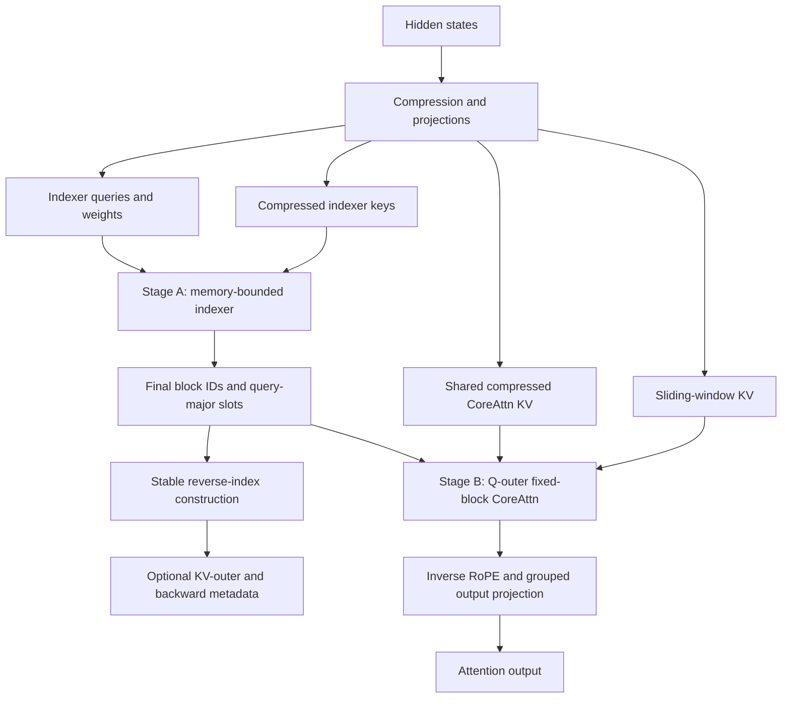
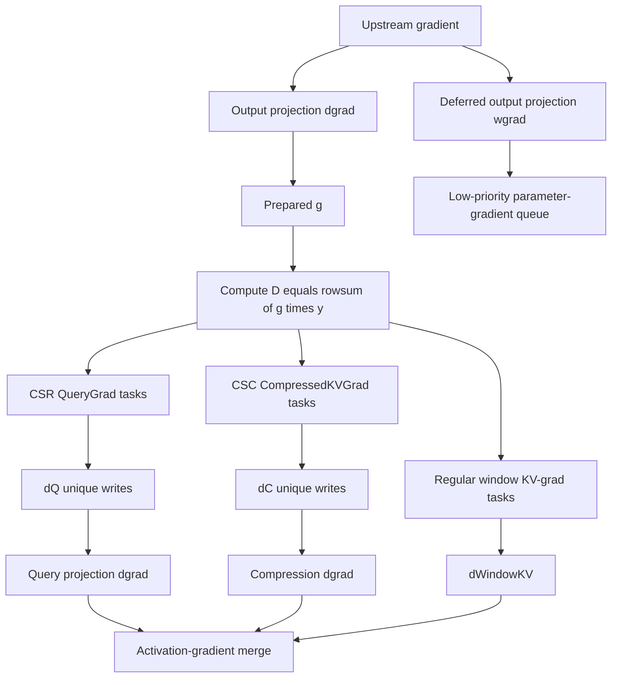

# Ferriox: Block-Routed Memory-Bounded Compressed Sparse Attention in Pure Rust

**Streaming Block Indexer + Block-Sparse Flash-Style Core Attention + Native Backward Runtime**  
**Technical Design Document — Revised July 2026**

> **Status:** correctness-first co-design. The primary Ferriox profile uses
> block-level KV selection with $b_K = 32$ compressed entries and $\kappa = 16$
> selected blocks. A separate $b_K = 1, \kappa = 512$ profile reproduces the
> per-entry selector of Ferriox's deterministic reference; full
> checkpoint-path parity with the published V4 kernel requires closure of
> the legal-domain and tie-break contracts (§2.4, §6.7). Forward selection
> and attention remain two logical phases even when kernels are fused.

---

## Abstract

Ferriox is a pure-Rust co-design of DeepSeek-V4-style Compressed Sparse Attention
(CSA), block routing, exact block-sparse CoreAttn, and a dependency-aware native
backward runtime for NVIDIA GPUs through cuda-oxide [11]. The design separates two
block scales that must not be conflated. The V4 compression stride $m = 4$
constructs one compressed entry per four new source positions. Ferriox then
places $b_K$ consecutive compressed entries into one *routing block* and selects
$\kappa$ routing blocks per query. The initial performance profile uses
$b_K = 32, \kappa = 16$, corresponding to a 128-source-position routing stride and a
maximum of $\kappa b_K = 512$ compressed entries per query. Setting
$b_K = 1, \kappa = 512$ reproduces the per-entry selector of Ferriox's deterministic
reference; full checkpoint-path parity with the published V4 kernel requires
closure of the legal-domain and tie-break contracts discussed in §2.4 and §6.7.

A naïve V4 lightning indexer materializes a $[B, S, H_I, T]$ head-wise score
tensor. At V4-Flash dimensions this tensor is 256 GiB for a 65,536-token
sequence. Ferriox instead reduces indexer heads inside a bounded score kernel,
max-pools legal entry scores into routing-block scores, and performs streaming
partition-merge top-$\kappa$. The max-pool profile still evaluates every legal
query/compressed-entry score: it reduces selection state, metadata, and irregular
CoreAttn access, but it does not change the indexer's quadratic arithmetic.

After final block IDs are known, Stage B expands each selected block on chip and
executes sink-aware sparse CoreAttn over its legal compressed entries plus the
separate tagged sliding-window entries. A temporary prefix top-$\kappa$ is never fed
to online softmax: FlashAttention's `(max, sum, output)` state supports insertion
but cannot delete a candidate evicted by a later key partition.

For training, Ferriox stores a compact query-major block view (CSR/fixed slots)
and constructs a reverse key-block-major view (CSC). Fixed-pattern backward is
then exposed as independently schedulable query-gradient and compressed-KV-
gradient tasks. The default deterministic research backend traverses CSR to write
$dQ$ once and CSC to write shared $dC$ once *within each slab,* trading
approximately 40% more edge arithmetic for removal of global gradient atomics
and terabyte-scale partial $dQ$ buffers. Cross-slab $dC$ reduction uses the
mechanism selected in §9.6. A FlashMoBA-style KV-major atomic backend remains
the first performance baseline.

The implementation plan has three measured stages: establish the block-sparse
semantic and atomic baseline; implement stable CSR/CSC and atomic-free dual-pass
backward; then move the attention operator into a Torch-independent Rust task
runtime with explicit streams, events, work queues, and distributed `B/W`
scheduling. Ferriox makes no end-to-end speedup claim before these stages are
measured separately and together.

---

## 1. Goals, Non-Goals, and Design Principles

### 1.1 Goals

1. **Preserve the V4 computation outside routing.** Match compressed KV
   construction, legal causal domain, shared key/value MQA, the tagged
   sliding-window source, attention sink, normalization, positional encoding, and
   grouped output projection. Preserve the original V4 selector only in the
   explicit $b_K = 1, \kappa = 512$ compatibility profile.
2. **Make block routing the primary co-designed profile.** Select contiguous
   routing blocks, execute all legal compressed entries in each selected block,
   and share one selected block set across all CoreAttn query heads.
3. **Bound indexer peak memory.** Never materialize the full
   $[B, S, H_I, T]$ score tensor. Fuse head reduction and block max-pooling where
   possible, while retaining a bounded correctness fallback.
4. **Make exactness explicit.** Prove equivalence to a materialized block-routing
   reference under deterministic entry- and block-level comparators. State V4
   equivalence only for the compatibility profile.
5. **Own the fixed-pattern backward.** Provide atomic, buffered, and CSR/CSC
   dual-pass schedules with explicit ownership, workspace, determinism, and
   numerical contracts.
6. **Provide an implementable Rust path.** Start with portable cuda-oxide kernels,
   then add Blackwell TMA/TMEM/UMMA and a native task runtime behind measured
   capability gates.
7. **Measure the whole pipeline.** Benchmark compression/projection, entry
   scoring, block max, top-$\kappa$, reverse-index construction, CoreAttn, backward,
   communication, and workspace independently and end to end.

### 1.2 Non-Goals

- Ferriox does **not** claim that block max-pooling makes the lightning indexer
  subquadratic. The canonical max-pool router still costs
  $\Theta(S^2 c_I H_I / m)$; only a separately trained centroid/block-key router
  could reduce that arithmetic.
- Ferriox does **not** claim that $b_K = 32, \kappa = 16$ is checkpoint-equivalent to
  V4's top-512 compressed entries. It is a Ferriox model profile that preserves
  the same maximum expanded CoreAttn budget.
- Ferriox does **not** accumulate attention for blocks that exist only in a
  temporary prefix top-$\kappa$.
- Ferriox does **not** materialize MSA/FSA-style full
  $[\kappa, S, H, c]$ output or $dQ$ partial buffers at million-token scale.
- Ferriox does **not** claim bitwise equality across different reduction orders,
  math approximations, quantization formats, or unordered atomic reductions.
- Ferriox does **not** differentiate through hard top-$\kappa$. The Ferriox block
  indexer is trained by an explicitly detached auxiliary objective.
- "Torch-free" initially means a self-scheduled attention sub-runtime exposed by
  an FFI boundary; it does not mean immediately reimplementing the full trainer,
  optimizer, MoE stack, checkpointing, and collectives.

### 1.3 Design Principles

- **Distinguish compression blocks from routing blocks.** $m$ determines the
  compressed representation; $b_K$ determines the hardware-facing selected unit.
- **Finalize selection before normalization.** Online softmax consumes a fixed,
  append-only set of blocks and entries.
- **Separate model semantics from kernel schedules.** Q-outer, KV-outer, atomic,
  and dual-pass schedules may change ownership and data movement, not support.
- **Use actual V4 dimensions in resource analysis.** Toy dimensions may be used
  for tests, but not for million-token feasibility claims.
- **Make ownership explicit.** Every output and gradient has one owner or a
  documented reduction protocol.
- **Prefer recomputation and bounded block partials over impossible global
  buffers.** Full probability, partial-output, and partial-$dQ$ tensors are not
  accepted simply because a smaller paper configuration could fit them.

---

## 2. Model Contract and Notation

### 2.1 Notation

| Symbol | Meaning |
|---|---|
| $L_{b}$ | Valid sample length for batch item $b$ |
| $D$ | Model hidden dimension |
| $d_{c}$ | Query latent dimension |
| $c$ | CoreAttn query/key/value dimension |
| $c_{I}$ | Lightning-indexer head dimension |
| $H$ | Number of CoreAttn query heads |
| $H_{I}$ | Number of indexer query heads |
| $m$ | Compression ratio |
| $T_{b} = \lfloor L_{b} / m \rfloor$ | Number of complete compressed entries for sample $b$ |
| $k_{V4}$ | V4 compatibility-profile top-k over individual compressed entries |
| $b_{K}$ | Number of consecutive compressed entries in one routing block |
| $\kappa$ | Maximum selected routing blocks per query |
| $K = \kappa b_{K}$ | Maximum expanded compressed-entry budget per query |
| $R_{b} = \lceil T_{b} / b_{K} \rceil$ | Number of physical routing blocks for sample $b$ |
| $w$ | Sliding-window size |
| $c_{S}$ | Query chunk size used by the indexer driver |
| $c_{T}$ | Compressed-key chunk size used by the indexer driver |
| $g_{A}$ | CoreAttn heads processed together by one CTA |
| $\beta$ | CoreAttn logit scale supplied by the model contract |

All semantic indices are zero-based. A query position $t$ is sample-relative;
packed samples must not share compression, window, or causal state.

### 2.2 DeepSeek-V4-Flash Dimensions and Ferriox Block Profile

The V4-Flash rows below come from [5]. The $b_K$, $\kappa$, $K$, and routing-stride
rows are Ferriox's derived initial block profile, not V4 hyperparameters:

| Parameter | Value |
|---|---:|
| $D$ | 4096 |
| $d_{c}$ | 1024 |
| $H$ | 64 |
| $c$ | 512 |
| $H_{I}$ | 64 |
| $c_{I}$ | 128 |
| $m$ | 4 |
| V4 entry top-k $k_{V4}$ | 512 |
| Ferriox routing-block entries $b_{K}$ | 32 |
| Ferriox selected blocks $\kappa$ | 16 |
| Ferriox expanded entry budget $K = \kappab_K$ | 512 |
| Routing stride in source positions `m b_K` | 128 |
| $w$ | 128 |
| output groups `g` | 8 |
| grouped intermediate width $d_{g}$ | 1024 |

In particular, $c_I = 128$ is the indexer dimension; it must not be substituted
for the CoreAttn dimension $c = 512$. Likewise, $m = 4$ and $b_K = 32$ are not
interchangeable: the former defines one compressed entry, while the latter groups
32 already-constructed entries into one routing unit. Because compression uses an
overlapping previous slice, a routing block has a 128-position source stride but
its complete receptive-field union is slightly wider.

### 2.3 Compressed KV Construction

For one sample with hidden states $H \in \mathbb{R}^{L \times D}$, CSA computes

$$
C^{a} = H W^{\mathrm{aKV}}, \quad C^{b} = H W^{\mathrm{bKV}} \qquad \text{in } \mathbb{R}^{L \times c} \\
Z^{a} = H W^{\mathrm{aZ}}, \quad Z^{b} = H W^{\mathrm{bZ}} \qquad \text{in } \mathbb{R}^{L \times c}.
$$

$B^{a}, B^{b} \in \mathbb{R}^{m \times c}$ are trainable positional biases indexed by token
slot and channel. They broadcast directly over the two $m \times c$ compression
slices below.

For compressed entry $i \in [0, T)$, define two $m \times c$ slices:

$$
A_i = [mi, m(i + 1)) \\
B_i = [m(i - 1), mi).
$$

The previous slice $B_0$ is padded with $-\infty$ in the compression logits
and zeros in the values. Softmax is taken independently for each channel across
the $2m$ token positions:

$$
[S_i^{a}; S_i^{b}]
    = \mathrm{Softmax}_{\mathrm{token}}([Z^{a}[A_i] + B^{a}; Z^{b}[B_i] + B^{b}]),

C_i^{\mathrm{Comp}}
    = \sum_{j \in A_i} S^{a}_{i,j} \odot C^{a}_j
    + \sum_{j \in B_i} S^{b}_{i,j} \odot C^{b}_j.
$$

Thus compressed entry $i$ depends on source positions
$[m(i - 1), m(i + 1))$, with the negative part padded for $i = 0$. A trailing
partial block is not compressed in the reference contract, so $T = \lfloor L/m \rfloor$.
Physical tile padding is always masked.

The indexer uses a distinct compressed tensor

$$
K^{\mathrm{IComp}} \in \mathbb{R}^{T \times c_I},
$$

constructed with the same compression pattern and the indexer-compressor tensors
specified by the checkpoint adapter. Ferriox does not infer whether any value,
logit, or positional-bias parameter is shared with the CoreAttn compressor; the
adapter must declare the exact reference parameter mapping. CoreAttn uses one
tensor

$$
C^{\mathrm{Comp}} \in \mathbb{R}^{T \times c}
$$

as both key and value. Ferriox does not model separate $K^{\mathrm{Comp}}$ and $V^{\mathrm{Comp}}$
allocations for the compressed branch.

### 2.4 Lightning Indexer and Legal Causal Domain

For query position $t$, the model produces

$$
c_t^{Q}     = h_t W^{\mathrm{DQ}}                           \qquad \text{in } \mathbb{R}^{d_c} \\
q^{I}_{\mathrm{raw},t} = c_t^{Q} W^{\mathrm{IUQ}}          \qquad \text{in } \mathbb{R}^{H_I \times c_I} \\
w^{I}_t     = h_t W^{w}                                    \qquad \text{in } \mathbb{R}^{H_I}.
$$

The checkpoint-compatible path prepares both indexer operands before scoring:

```text
q^I_t       = PrepareV4IndexQuery(q^I_raw,t, position=t, metadata)
K^IComp_s   = PrepareV4IndexKey(K^IComp_raw,s, position=pi_I(s), metadata).
```

The adapter contract fixes the RoPE convention, indexer-key position `pi_I(s)`,
Hadamard rotation, quantization order, scale granularity, and accumulation rules.
An FP32 algorithm reference may replace quantization with dequantized arithmetic,
but it must not omit real-valued positional or rotation transforms that change
the score. The score of compressed entry $s$ is then

$$
I_{t,s} = \sum_{r=0}^{H_I-1}
              w^{I}_{t,r}\, \mathrm{ReLU}(\mathrm{dot}(q^{I}_{t,r}, K^{\mathrm{IComp}}_s)).
$$

Because $C^{\mathrm{Comp}}_s$ contains tokens through position $m(s + 1) - 1$, it is legal
for query $t$ only when the complete compressed entry is in the query's past:

$$
T_{\mathrm{legal}}(t)  = \lfloor (t + 1) / m \rfloor,
D_t                    = \{0, 1, \dots, T_{\mathrm{legal}}(t) - 1\},
k_{\mathrm{V4\_eff}}(t) = \min(k_{\mathrm{V4}}, T_{\mathrm{legal}}(t)).
$$

This is the zero-based Ferriox convention, consistent with StreamIndex [6].
The V4 paper writes $s < \lfloor t/m \rfloor$ (one-based $t$) and states a query cannot
access its own compressed block [5, App. B.2]. The two forms are believed
equivalent after adjusting the position base, but equivalence has not been
confirmed against the published V4 kernel; the existing tests at
$t = m-1, m, 2m-1$ verify Ferriox against its own reference only. Closure
requires running the same boundary positions on the released V4 implementation
and comparing the resulting legal sets.

The V4 compatibility top-k and Ferriox block-internal maximum are defined only
over legal entries. Legal $(score, entry\_index)$ pairs use the strict total
order:

$$
(a, i) > (b, j) \quad \text{iff} \quad a > b \;\text{or}\; (a = b \;\text{and}\; i < j).
$$

Masked entries, physical padding, and sentinels are excluded before every entry
maximum or compatibility-profile top-k; they never participate in this
comparator. Candidate buffers may carry an occupancy/valid bit, but reduction
first filters unoccupied slots. The lower entry index wins an exact legal-score
tie. A legal NaN score is converted to $-infinity$ and remains in the legal
domain; debug builds additionally report it. In the compatibility profile, if
$T_{\mathrm{legal}}(t) < k_{\mathrm{V4}}$, invalid $(-\infty, -1)$ sentinels are appended only after
selection is complete.

### 2.5 Block-Routing Contract

#### 2.5.1 Two nested block scales

A *compressed entry* is the output of Section 2.3 and advances by $m$ source
positions. A *routing block* is a contiguous group of $b_K$ compressed entries.
For sample length $L$, $T = \lfloor L/m \rfloor$, define

$$
G_r = \{s \mid r b_K \leq s < \min((r + 1)b_K, T)\},
R   = \lceil T / b_K \rceil.
$$

For query $t$, let $J_t = T_{\mathrm{legal}}(t)$ and

$$
G_{t,r} = G_r \cap \{0, \dots, J_t - 1\},
A_t     = \{r \mid G_{t,r} \text{ is non-empty}\}
        = \{0, \dots, \lceil J_t / b_K \rceil - 1\}.
$$

A causal partial routing block contains only complete compressed entries that are
already legal. It is not a trailing partial compressed entry, which remains
forbidden by Section 2.3.

#### 2.5.2 Entry score, block score, and deterministic order

Ferriox retains the V4 lightning score $I_{t,s}$ for each legal compressed entry.
The canonical block profile then performs MSA-style post-score max pooling [12]:

$$
(M_{t,r}, \mathrm{winner}_{t,r})
    = \max_{s \in G_{t,r}} \text{ under the entry comparator }
      (\mathrm{sanitize\_nan}(I_{t,s}), s).
$$

The entry comparator prefers the larger score and then the smaller compressed
entry index. Max pooling occurs *after* the complete head reduction:

$$
\max_s \Bigl[\sum_h w^{I}_{t,h}\, \mathrm{ReLU}(\mathrm{dot}(q^{I}_{t,h}, K^{\mathrm{IComp}}_s))\Bigr].
$$

It is not equivalent to moving $\max_s$ inside the head sum, averaging the keys,
or applying ReLU after block aggregation.

Routing blocks use the total order

$$
(a, r) >_B (b, u) \quad \text{iff} \quad a > b \;\text{or}\; (a = b \;\text{and}\; r < u).
$$

Selection ranks raw block scores directly. Applying softmax before top-$\kappa$ would
not change their order and would add unnecessary max/exp/sum work, so the selector
is exp-free as in MSA [12].

Let

$$
\kappa_{\mathrm{eff}}(t) = \min(\kappa, \lceil J_t / b_K \rceil),
R_t = \mathrm{TopK}_{\kappa}(\{(M_{t,r}, r) \mid r \in A_t\}).
$$

Invalid $(-\infty, -1)$ block slots are appended only after all legal blocks
have participated. $R_t$ has no CoreAttn-head axis: the one query-level block set
is shared by all $H$ heads, matching V4's head-reduced lightning score. Selected
block IDs are canonicalized in ascending block order. Within a selected block,
Stage B visits compressed entries in ascending entry order.

Ferriox does not force the newest block into $R_t$ in the canonical profile. MSA
uses a forced local block [12], but Ferriox already has a distinct sliding-window
source, and forcing a block would break strict $b_K = 1$ compatibility. A future
$force_latest_block$ profile must be versioned as a separate model contract and
must state whether it consumes one of the $\kappa$ slots.

#### 2.5.3 Expanded fixed support

The compressed support induced by selected blocks is

$$
U_t = \bigcup_{r \in R_t} G_{t,r}.
$$

Because routing blocks do not overlap in compressed-entry space,

$$
|U_t| \leq \kappa b_K = K.
$$

If the selected causal partial block contains $p < b_K$ legal entries, then
$|U_t|$ can be smaller than $K$; physical padding remains masked. Stage B derives
entry IDs arithmetically as $s = r b_K + \mathrm{lane}$ and does not materialize an
expanded $[B, S, K]$ index tensor.

#### 2.5.4 Compatibility and performance profiles

Ferriox exposes two explicit profiles:

``$text
V4 compatibility:
    b_K = 1
    \kappa   = k_V4 = 512

Ferriox block routing:
    b_K = 32 compressed entries
    \kappa   = 16 routing blocks
    K   = \kappa b_K = 512 compressed entries
$``

For $b_K = 1$, each $G_r = \{r\}$, so $M_{t,r} = I_{t,r}$, the block comparator
is the original entry comparator, and $U_t$ is the Ferriox deterministic top-512
set under the legal-domain and tie-break conventions of §2.4. Equivalence to the
published V4 selector depends on the contracts discussed in §6.7. For
$b_K = 32$, one high-scoring entry admits the other legal entries in its block;
the result is therefore a new model profile rather than a kernel-only equivalent
transformation. The profile keeps V4's maximum expanded CoreAttn budget while
making selection and execution block regular.

#### 2.5.5 Alternative block routers are separate model variants

A centroid or learned block key can reduce Stage A score arithmetic:

$$
K^{R}_r = \mathrm{mean}_{s \in G_r} K^{\mathrm{IComp}}_s,
I^{R}_{t,r} = \sum_h w^{I}_{t,h}\, \mathrm{ReLU}(\mathrm{dot}(q^{I}_{t,h}, K^{R}_r)).
$$

This costs roughly $1/b_K$ of entry scoring, as explored by MoBA/FlashMoBA
[15,16], but $I^{R}_{t,r}$ is not equal to $\max_s I_{t,s}$. A static centroid for
the causal partial block can also contain future entries. Ferriox therefore
keeps post-score max pooling as the primary contract and treats centroid routing
as a separately trained research profile with its own quality and causality
gates.

### 2.6 Complete CoreAttn Semantics

The CoreAttn entry list is the concatenation of two *tagged* sources:

$$
E_t^{\mathrm{comp}} = \{(\mathrm{compressed}, s) \mid s \in U_t\} \\
E_t^{\mathrm{win}}  = \{(\mathrm{window}, u) \mid \max(0, t - w + 1) \leq u \leq t\} \\
E_t      = E_t^{\mathrm{comp}} \;\|\; E_t^{\mathrm{win}}.
$$

Compressed and window entries remain distinct even when they derive from
overlapping source tokens. They must not be deduplicated.

The CoreAttn query shares the same latent $c_t^{Q}$ as the indexer query:

$$
[q_{t,0}; \dots; q_{t,H-1}] = c_t^{Q} W^{\mathrm{UQ}} \in \mathbb{R}^{H c}.
$$

The reference preparation path is defined by the checkpoint adapter. Its required
shape is:

```text
q'_{t,a}      = PartialRoPE(t, RMSNorm(q_{t,a}))
x'^comp_s     = PartialRoPE(pi_comp(s), RMSNorm(C^Comp_s))
x'^win_u      = PartialRoPE(u, RMSNorm(C^Win_u))
```

`PartialRoPE` operates on the last 64 dimensions. `pi_comp(s)`, RoPE parameters,
normalization parameters, window-entry construction, and $beta$ must be extracted
from the reference implementation rather than guessed from the paper. V4 uses a
shared key/value entry, so $k_e = v_e = x'_e$ for both compressed and window
entries unless a future checkpoint adapter explicitly defines another contract.
After attention, the last 64 output dimensions receive `PartialRoPE(-t, ...)`.

Let the prepared key and value of entry $e$ be $k_e, v_e \in \mathbb{R}^c$. With a
learnable sink logit $z'_a$, CoreAttn is

$$
z_{t,a,e} = \beta \cdot \mathrm{dot}(q'_{t,a}, k_e)
\\
p_{t,a,e} = \frac{\exp(z_{t,a,e})}
                 {\exp(z'_a) + \sum_{x \in E_t} \exp(z_{t,a,x})}
\\
y_{t,a}   = \sum_{e \in E_t} p_{t,a,e}\, v_e
\\
\bar{o}_{t,a} = \mathrm{PartialRoPE}(-t, y_{t,a}).
$$

The sink contributes to the denominator and has an implicit zero value. Therefore
attention weights over real entries may sum to less than one.

For grouped output projection, partition the $H$ heads into $g$ ordered contiguous
groups $G_r$, concatenate each group's outputs, and apply

$$
u_{t,r} = \mathrm{concat}(\bar{o}_{t,a} \text{ for } a \in G_r)\, W^{G}_r \in \mathbb{R}^{d_g}
\\
\mathrm{out}_t = \mathrm{concat}(u_{t,0}, \dots, u_{t,g-1})\, W^{O} \in \mathbb{R}^{D},
$$

where $W^{G}_r \in \mathbb{R}^{(cH/g) \times d_g}$ and $W^{O} \in \mathbb{R}^{(g d_g) \times D}$. Head-group order
and all weight layouts are part of the checkpoint adapter. Until the adapter has
fixed $pi_I$, $pi_comp$, RoPE/quantization metadata, and these projection layouts,
Ferriox provides the algorithmic contract but does not claim checkpoint-bitwise
V4 parity.

---

## 3. Architectural Invariant: Selection Must Finish First

### 3.1 Why Prefix Top-$\kappa$ Cannot Be Interleaved with Exact Attention

A streaming block top-$\kappa$ is correct because the final heap after all routing
blocks equals the global top-$\kappa$. Its *intermediate* heaps are not final.

Consider $\kappa = 1$:

1. The first key partition contains routing block `A` with block score $1$. `A`
   enters the prefix top-1.
2. Attention for the entries in `A` is accumulated into `(m, ell, O_tilde)`.
3. A later partition contains routing block $B$ with score $2$. $B$ evicts `A`,
   so the final top-1 is ${B}$.
4. The online-softmax state still contains entries from `A` in its denominator
   and numerator.

FlashAttention's online state supports adding a score block. It does not retain
enough information to delete an arbitrary prior element, especially when the
deleted element supplied the running maximum. Therefore a single loop that
immediately attends to temporary top-$\kappa$ blocks is not equivalent to attention
on the final block top-$\kappa$.

An exact implementation must do one of the following:

- finalize block top-$\kappa$, then load the selected CoreAttn blocks; or
- retain enough per-candidate block attention data to reconstruct the final
  reduction.

The second option requires storage proportional to live candidates' per-head
attention data and is impractical at $K = c = 512$, $H = 64$. Ferriox uses the
first option.

### 3.2 Two-Stage Dataflow



The architectural boundary is logical, not necessarily a kernel-launch boundary:

- **Reference/training path:** Stage A writes final block IDs. A stable transpose
  may build the key-block-major reverse view for forward/backward scheduling;
  Stage B reads only finalized IDs.
- **Chunked inference path:** Stage A and Stage B pipeline by query slab and reuse
  a bounded $[c_S, \kappa]$ block-ID buffer.
- **Optional persistent path:** one kernel may finish Stage A for a query
  microtile, keep its final IDs on chip, then execute Stage B. It still performs
  two sequential phases and does not reuse $K^IComp$ as $C^Comp$, because they
  are different tensors.

---

## 4. Stage A: Memory-Bounded Lightning Indexer

### 4.1 Required Properties

Stage A must:

- reduce the $H_I$ head axis before any score tile is written to HBM;
- apply entry-level causal/tail masks before block max pooling;
- complete every routing-block maximum before that block enters top-$\kappa$;
- preserve FP32 reduced entry scores, block maxima, and running top-$\kappa$ scores in
  the correctness path;
- include every legal block when fewer than $\kappa$ blocks exist;
- use the deterministic entry and block comparators from Section 2.5;
- emit exactly $\kappa$ block IDs per query, padded with $-1$ after selection;
- canonicalize surviving IDs by block ID without changing the selected set.

### 4.2 Baseline Chunked Block Algorithm

The baseline combines StreamIndex's partition-merge structure [6] with MSA's
post-score block max [12]. It evaluates V4 entry scores in bounded tiles, emits
one score per routing block, and maintains only $\kappa$ running candidates.

``$text
Algorithm 1: Memory-Bounded Block Indexer

Inputs:
  q_idx      [B, S, H_I, c_I]       // prepared indexer queries
  w_idx      [B, S, H_I]
  k_idx_comp [B, T_max, c_I]         // prepared entry-level indexer keys
  lengths    [B]
  m, b_K, \kappa, c_S, c_T

Outputs:
  block_idx  [B, S, \kappa] int32, padded with -1

require c_T % b_K == 0 for the baseline
schedule query chunks [q0, q1) through at most P_slot workspace slots:
    run_valid = false     [B, q1-q0, \kappa]
    run_score = -infinity [B, q1-q0, \kappa] FP32
    run_block = -1        [B, q1-q0, \kappa] int32

    max_legal = max T_legal(sample_pos(b,t)) over valid queries in this chunk
    for block-aligned entry chunk [s0, s1) with s0 < max_legal:
        // Head reduction precedes block max. No [H_I] score tensor is written.
        for entry microtile [u0, u1) inside [s0, s1):
            entry_score = zeros [B, q1-q0, u1-u0] FP32
            for indexer-head group g:
                partial = q_idx[:, q0:q1, g, :] @
                          transpose(k_idx_comp[:, u0:u1, :])
                entry_score +=
                    sum_g w_idx[:, q0:q1, g] * ReLU(partial)

            sanitize legal NaNs to -infinity
            mask s >= T_legal(t) before pooling
            update deterministic (block_max, winning_entry)
                for block_id = floor(s / b_K)

        local = deterministic_topk_blocks(
            completed legal block maxima in [s0, s1), limit=\kappa)

        run_candidates = filter_occupied(run_valid, run_score, run_block)
        run_valid, run_score, run_block = store_with_occupancy(
            deterministic_topk_blocks(
                concatenate(run_candidates, local), limit=\kappa))

    append invalid (false, -infinity, -1) sentinels to reach \kappa slots
    canonical_sort surviving block IDs in ascending order
    write block_idx[:, q0:q1, :]
$``

$c_T$ and its start offset are block-aligned in the first implementation. An
unaligned future implementation must carry boundary-block partial maxima across
chunks and submit a block to top-$\kappa$ exactly once; treating two partial maxima as
two candidates is incorrect.

For $b_K = 1, \kappa = 512$, Algorithm 1 reduces to the V4-compatible StreamIndex
partition-merge algorithm. For $b_K = 32, \kappa = 16$, entry QK arithmetic is
unchanged, but block candidates, running state, and persistent IDs are reduced by
approximately 32 times.

### 4.3 Workspace

An unfused correctness implementation may still write a bounded entry-score tile:

$$
P_{\mathrm{slot}} \cdot B \cdot c_S \cdot c_T \cdot \mathrm{sizeof(float)}.
$$

For $B = 1$, $c_S = 2048$, and $c_T = 8192$, this is 64 MiB per slot. If head
reduction, legal masking, and max pooling over $b_K = 32$ are fused, the HBM
scratch becomes

$$
P_{\mathrm{slot}} \cdot B \cdot c_S \cdot (c_T / b_K) \cdot \mathrm{sizeof(float)},
$$

or 2 MiB per slot. This reduces score-scratch traffic, not entry QK FLOPs.

The running `(valid, FP32 score, int32 block_id)$ state costs

$$
B \cdot c_S \cdot \kappa \cdot 8 \; \text{bytes}.
$$

At $c_S = 2048, \kappa = 16$, it is exactly 256 KiB before occupancy metadata,
compared with 8 MiB for 512 entry candidates. Local candidates and ping-pong
merge buffers are budgeted separately but have the same $O(c_S \kappa)$ scale.
$P_slot$ remains bounded by the configured workspace limit.

### 4.4 Optimized Indexer Variants

#### A. Fused score + local selection

Compute a reduced entry-score microtile, max-pool completed routing blocks,
immediately select local block top-$\kappa$, and write only local block candidates.
This removes reduced-score scratch traffic but requires a resource-feasible
distributed selection primitive.

#### B. Persistent query microtile

A CTA owns a small number of query rows, scans all legal compressed-entry chunks,
max-pools routing blocks, and keeps running block top-$\kappa$ on chip. The resource
constraint is

$$
B_r \cdot \kappa \cdot 8 \; \text{bytes} + \text{block-max scratch} + \text{barriers} + \text{staged operands}
    \leq \text{SMEM budget}.
$$

At $\kappa = 16$, $B_r = 128$ needs only 16 KiB for score/block-ID pairs, versus
512 KiB in the V4 compatibility profile. Persistent block selection is therefore
a realistic optimization target; score fragments, head reduction, and staging,
not top-$\kappa$ state, become the main resource gates. State remains CTA-distributed,
never private per thread.

#### C. Hierarchical partition-merge

Independent CTAs produce partition-local candidates, followed by one or more
merge kernels. This increases candidate workspace but can improve parallelism and
avoid a long persistent scan.

The implementation chooses among these variants by sequence length, available
workspace, and measured launch/merge overhead. Larger $c_T$ generally amortizes
merge overhead better when workspace permits [6].

### 4.5 Edge Conditions

- Compression and causal positions are sample-relative.
- A packed sequence boundary resets compression overlap and sliding-window state.
- $T_b = floor(L_b/m)`; no partial compressed entry is silently created.
- Physical entry tails are masked before block max; the last physical routing
  block may contain fewer than $b_K$ complete entries.
- `T_legal(t) = 0` produces an all-$-1$ block-ID row; the resulting empty support
  $U_t = \varnothing$ is excluded from the auxiliary KL loss (§9.9) to avoid
  mathematically undefined softmax.
- A causal partial routing block participates using only its legal entries.
- A chunk with fewer than $\kappa$ legal blocks contributes all of them.
- Entry ties use the global compressed-entry ID; block ties use the global block
  ID, never chunk-local IDs.
- $c_T$ is routing-block aligned unless boundary partial maxima are explicitly
  carried and merged.

### 4.6 Query-Major and Reverse Block Views

The fixed $[B, S, \kappa]$ block slots are the query-major CSR-equivalent view. For
$\kappa = 16$, the row offset is implicit ($row_start = query_id * \kappa$), so no CSR
row-pointer array is required. Training additionally constructs a reverse view:

```text
block_count [R]
block_offset[R + 1]
query_handle[nnz]
```

Following FlashMoBA [16], construction is:

1. map sample-local block `r` to $sample_block_base[b] + r$ so equal local IDs in
   packed samples never share a segment;
2. histogram selected global block IDs;
3. exclusive scan counts into offsets;
4. scatter one packed handle per valid `(sample,query,selected block)` edge.

For deterministic backward, the final handles inside each block segment must have
a stable canonical order such as `(query_id, slot)`. A plain unordered
`atomicAdd(cursor[block])` scatter is valid for nondeterministic kernels but is
not sufficient for bitwise-repeatable reduction. The deterministic builder uses
stable counting/radix transpose or sorts each segment after scatter.

At $S = 1,000,000, \kappa = 16$, the capacity is 16 million block edges. With int32
block IDs and int32 reverse handles:

| Item | Size |
|---|---:|
| query-major block IDs | 64,000,000 bytes = 61.04 MiB |
| reverse query handles | 64,000,000 bytes = 61.04 MiB |
| block offsets/counts | < 0.1 MiB for $R = 7{,}813$ |

A profile-specific sample-local $u16$ block ID is safe for $R < 65,535$ and
reduces the first array to 30.52 MiB. A 32-bit reverse handle can pack a 20-bit
shard-local query ID, 4-bit slot, and flags at the one-million-query shape. Both
formats require runtime range checks and fall back to generic int32/64-bit
handles for larger batches or shards. The packed dual view is about 91.6 MiB; a
generic all-int32 view is about 122.1 MiB. Both are far smaller than the 1.91 GiB V4-compatible
$[S,512] int32$ list. Support is shared across CoreAttn heads and is not
replicated by $H$.

The reverse view is built once after forward selection and reused by optional
KV-outer forward, fixed-pattern backward, and degree-aware scheduling. A future
checkpointed mode may rebuild it before backward, but the time/liveness trade-off
must be measured.

---

## 5. Stage B: Fixed-Block Sparse CoreAttn

### 5.1 Online Softmax with an Attention Sink

Following online normalizer calculation [13], for one query $t$ and CoreAttn head
`a`, initialize the online state with the virtual sink entry:

$$
m       = z'_a \\
\ell     = 1 \\
\tilde{O} = \mathbf{0} \in \mathbb{R}^c.
$$

For any fixed block of real entries with logits $z_j$ and values $v_j$:

$$
m_{\mathrm{new}}       = \max(m, \max_j z_j) \\
\rho         = \exp(m - m_{\mathrm{new}}) \\
p_j         = \exp(z_j - m_{\mathrm{new}}) \\
\ell_{\mathrm{new}}     = \rho \cdot \ell + \sum_j p_j \\
\tilde{O}_{\mathrm{new}} = \rho \cdot \tilde{O} + \sum_j p_j \cdot v_j
$$

Then

$$
o   = \tilde{O} / \ell \\
\mathrm{LSE} = m + \log(\ell).
$$

There is no inverse on the old-output rescaling factor. The factor is
$\exp(m_{\mathrm{old}} - m_{\mathrm{new}})$, which is at most one.

### 5.2 Forward Algorithm

``$text
Algorithm 2: Sparse CoreAttn Forward

Inputs:
  q_core       [B, S, H, c]
  c_comp       [B, T_max, c]       // shared compressed key/value
  block_idx    [B, S, \kappa] int32
  window_kv    model-defined uncompressed sliding-window entries
  sink_logit   [H]
  lengths      [B]
  beta, m, b_K, \kappa, w

Outputs:
  o_core       [B, S, H, c]
  lse          [B, S, H]

for each valid (b, t, head-group) in parallel:
    q_prepared = PrepareCoreQuery(q_core[b,t,head-group], position=t)

    for each head a in the group:
        m_a = sink_logit[a]
        ell_a = 1
        O_tilde_a = 0 in R^c

    // block_idx is canonicalized by block ID; entries are generated on chip.
    for block_slot = 0 .. \kappa-1:
        r = block_idx[b,t,block_slot]
        if r == -1:
            continue

        for lane = 0 .. b_K-1:
            s = r * b_K + lane
            if s >= T_legal(t):                 // causal/physical partial block
                continue

            C = load prepared c_comp[b,s,:]
            for each head a in the group:
                z = beta * dot(q_prepared[a,:], C.key)
                online_update(m_a, ell_a, O_tilde_a, z, C.value)

    for u = max(0, t-w+1) .. t:               // sample-relative
        physical_u = sample_start[b] + u
        K_u, V_u = load prepared shared-KV window entry at physical_u
        for each head a in the group:
            z = beta * dot(q_prepared[a,:], K_u)
            online_update(m_a, ell_a, O_tilde_a, z, V_u)

    for each head a in the group:
        o_core[b,t,a,:] = PartialRoPE(-t, O_tilde_a / ell_a)
        lse[b,t,a] = m_a + log(ell_a)

apply grouped output projection to o_core -> output [B, S, D]
$``

The compressed and window loops may be interleaved or reordered because their
entry set is fixed. Reordering changes floating-point reduction order, so the
exact-parity mode uses the canonical order defined by the reference.

### 5.3 Default Q-Outer Block Backend

The primary Ferriox profile is irregular only at the block-ID level. Every
selected routing block contributes a contiguous $b_K x c$ compressed-KV matrix.
The default forward owner is `(query row, head group)`: it traverses that query's
$\kappa$ blocks, keeps one sink-aware online-softmax state, and writes the final output
once. This avoids global partial outputs.

A practical CTA mapping is:

- one query position and one CoreAttn head group per CTA or cooperative cluster;
- load one $b_K x c$ compressed block contiguously and reuse it across $g_A$
  query heads because V4/Ferriox use shared MQA KV;
- compute dense score tiles $[g_A, b_K]$ and PV updates with UMMA where the
  resource report permits, with a vector fallback for the correctness path;
- maintain independent `(m, ell)` and output state per query head;
- process the causal partial block with a lane mask before softmax;
- fold the tagged window source into the same query-owned online state.

Ignoring index/softmax traffic and assuming a selected `C` block is loaded once
for all $H$ heads, ideal BF16 arithmetic intensity for one query is

$$
\mathrm{AI}_Q \approx \frac{4 H c K}{2 c (2H + K)}
     = \frac{2 H K}{2H + K}.
$$

At $H = 64, K = 512$, this is approximately 102.4 FLOPs/byte. Actual intensity
falls when `C` must be replayed across `ceil(H/g_A)` CTAs, so $g_A$, L2 reuse,
and cluster-level multicast are tuning dimensions.

The output state is the main resource constraint. A full FP32 $[64,512]$ state is
128 KiB; a $g_A = 32$ state is 64 KiB. The implementation may split heads or the
output dimension, use TMEM for supported accumulator shapes, and recompute score
fragments, but it may not silently spill an unbounded per-query state to HBM.

### 5.4 Optional KV-Outer Gather-and-Densify Backend

MSA [12], FSA [14], and FlashMoBA [16] invert the sparse relation: each selected
KV block gathers all queries that chose it, packs query/head rows into full MMA
shapes, and reuses the block across those rows. Ferriox can execute the same
schedule using Section 4.6's reverse view:

```text
for each (routing_block, query_chunk) task:
    load C_block once
    gather query/head rows selecting the block
    compute dense QK/PV physical tiles
    emit one partial online-softmax state per query/head
```

Each query additionally owns a **base partial** initialised from the tagged
sliding-window entries and exactly one virtual sink (§5.1) before any
routing-block partial is combined. The combine step therefore merges:

```text
combine for each query:
    base_partial = sink + tagged_window
    for each routing_block partial owned by this query:
        base_partial = online_softmax_merge(base_partial, block_partial)
```

Without this base partial, the sink is either duplicated (once per block
partial) or omitted entirely, and the window entries never enter the
KV-outer softmax. The compute, LSE, workspace, and combine traffic for the
base partial are counted in the HBM model (§7.7).

Note: FSA's "attention sink separate allocation" refers to the first real
KV block of a high-degree head [14], not Ferriox's learnable zero-value
virtual sink. The two are not interchangeable.

This backend is attractive when block degree is high and Q-outer replay dominates.
It also enables degree-aware persistent scheduling and splits popular early
blocks across CTAs.

It is not the default million-token forward because the natural two-phase MSA
buffer is enormous in Ferriox dimensions. A full BF16
$Obuf[\kappa,S,H,c]$ at $\kappa=16, S=1M, H=64, c=512$ is approximately 976.6 GiB; FP32 is
about 1.91 TiB, and $LSEbuf[\kappa,S,H]$ adds 3.81 GiB. Therefore KV-outer forward must
operate on bounded query slabs and head groups, immediately reduce partials, or
use a hierarchical owner schedule. It is enabled only when its complete
workspace and HBM traffic beat Q-outer.

### 5.5 Logical and Physical Blocks

The routing block is a model-level unit of $b_K$ compressed entries. Physical
MMA tiles are hardware units and may be smaller. For $b_K = 32, c = 512$, a
kernel can issue one or more $N = 32$ score tiles, split $c$ across K fragments,
or concatenate work from multiple tasks when supported. It must not merge two
selected routing blocks into one semantic block or expose masked entries to
softmax.

Unlike the previous arbitrary-entry design, dense block work no longer depends
on accidental tile fill ratio. The remaining dispatch questions are ownership,
block degree, query gather cost, output-state pressure, and whether Q-outer or
KV-outer yields the lower complete IO cost.

---

## 6. Correctness

### 6.1 Lemma 1: Entry-Score Separability

For fixed query $t$, $I_{t,s}$ depends on query-side values and compressed key
$s$, but not on any other compressed key. Therefore legal entry scores may be
evaluated in any partition order. This is the separability used by StreamIndex
[6]; it does not permit moving block max inside the indexer-head reduction.

### 6.2 Lemma 2: Routing-Block Max Is Partition-Mergeable

Let a legal routing block $G_{t,r}$ be split across any collection of disjoint
entry microtiles $P_1, \dots, P_n$. Each microtile returns its maximum under the
entry comparator:

$$
x_i = \max_{s \in P_i \cap G_{t,r}} (\mathrm{sanitize\_nan}(I_{t,s}), s).
$$

Because maximum under a strict total order is associative and commutative,

$$
\max_i x_i
    = \max_{s \in G_{t,r}} (\mathrm{sanitize\_nan}(I_{t,s}), s)
    = (M_{t,r}, \mathrm{winner}_{t,r}).
$$

Thus a boundary routing block may be reduced from partial maxima, provided it is
submitted to top-$\kappa$ only after all of its legal pieces are complete. The aligned
baseline avoids this extra state.

### 6.3 Lemma 3: Partition-Merge Block Top-$\kappa$

Let $>_B$ be the total order on $(block\_score, block\_id)$ from Section 2.5. For
any disjoint partition of the legal routing-block domain, the global top-$\kappa$ is
the top-$\kappa$ of the union of each partition's local top-$\kappa$. Repeated merge
therefore returns exactly the global $\kappa_{\mathrm{eff}}(t)$ blocks.

Entry masks are applied before block max; empty blocks never become candidates;
unoccupied running slots are filtered before merge; and sentinels are appended
only after selection. Consequently, an invalid slot cannot displace a legal block
even when every legal block score is $-\infty$.

### 6.4 Lemma 4: Support Expansion Is Unique

Routing blocks form a disjoint partition of compressed-entry indices. Therefore
canonical selected block IDs $R_t$ induce exactly one compressed support

$$
U_t = \bigcup_{r \in R_t} G_{t,r},
$$

and arithmetic expansion $s = r b_K + \mathrm{lane}$ enumerates each legal selected
compressed entry exactly once. The tagged window source is not part of this
union, so source-token overlap between compressed and window paths does not cause
an accidental deduplication.

### 6.5 Lemma 5: Fixed-Support Online Softmax

For the fixed concatenated list $E_t$, the recurrence in Section 5.1 maintains

$$
\begin{aligned}
m       &= \max\{\text{processed logits including the sink}\} \\
\ell     &= \sum \exp(\text{logit} - m) \quad \text{over sink and processed entries} \\
\tilde{O} &= \sum \exp(\text{logit} - m) \cdot \text{value over processed real entries}.
\end{aligned}
$$

The invariant holds by induction over physical tiles. The sink has value zero, so
initializing $(m, \ell, \tilde{O}) = (z', 1, \mathbf{0})$ is equivalent to processing it as a
virtual first entry. Q-outer execution uses one recurrence directly; KV-outer
execution must combine partial $(\mathrm{LSE}, O)$ states with the same algebra.

### 6.6 Theorem: Ferriox Block-Profile Forward Equivalence

Assume:

1. compression, projection, normalization, RoPE, sink, window, and grouped output
   operations match the executable model adapter;
2. the materialized reference evaluates the same legal entry scores, performs
   post-score block max with the same entry comparator, and uses the same block
   comparator;
3. Stage A emits only finalized top-$\kappa$ block IDs;
4. Stage B expands exactly $U_t$ and appends the same tagged window entries;
5. arithmetic is exact, or both paths use the same floating-point operations and
   canonical reduction order.

Then Algorithms 1 and 2 produce the same block set, expanded compressed support,
CoreAttn output, LSE, and grouped output as that materialized block-routing
reference.

The proof applies Lemma 2 to each block maximum, Lemma 3 to block selection,
Lemma 4 to support expansion, and Lemma 5 to attention. It does not apply to a
kernel that consumes temporary prefix blocks.

### 6.7 Corollary: V4 Compatibility at `b_K = 1$ — Status and Open Contracts

Setting $b_K = 1, \kappa = k_V4$ makes each routing block a single compressed entry:
block max is the identity, the block comparator reduces to the entry comparator,
and the block theorem yields $U_t$ as the Ferriox deterministic top-\kappa set under
the conventions of §2.4 and §2.5.3. This establishes equivalence with *Ferriox's
own materialised per-entry reference*.

Two external contracts are **not yet closed** by published data:

1.  **Legal causal boundary.**
    Ferriox defines $T_{\mathrm{legal}}(t) = \lfloor (t+1)/m \rfloor$ (zero-based $t$).
    The V4 paper writes $s < \lfloor t/m \rfloor$ with a one-based $t$ and
    states that a query cannot access its own compressed block [5, App. B.2].
    The two forms may be equivalent after adjusting the position base, but
    confirmation requires testing against the published V4 kernel at
    $t = m-1, m, 2m-1$ (self-block boundary).

2.  **Tie-break and top-\kappa selector semantics.**
    Ferriox uses the StreamIndex deterministic rule "smaller entry ID wins a
    tie" [6], and $torch.topk$ does **not** guarantee this tie-break [6].
    The V4 paper has not published its exact selector order or tie-break.
    In FP4, ReLU-masked, and high-zero-score regimes, ties are not
    theoretical; a different tie-break or top-\kappa order can produce a
    different selected set, different LSE, different output, and different
    fixed-support backward.

Therefore the correct claim before both contracts are closed is:

> **$b_K = 1$ yields equivalence with the Ferriox deterministic
> per-entry reference; full checkpoint-path parity with the published
> V4 kernel requires closed legal-boundary and tie-break golden tests.**

Closing plan: incorporate the V4 legal-boundary convention and the
published kernel's actual tie-break / top-\kappa order into the checkpoint
adapter, then run boundary and tie-heavy FP4 golden tests against the
released V4 implementation.

For $b_K > 1$, Ferriox claims equivalence only to the block-routing
reference, not to V4 top-512 entries. Quality must be established by
training and evaluation.

### 6.8 Floating-Point, Quantized, and Selection Scope

Top-$\kappa$ is discontinuous. A small score error can swap blocks around the
$\kappa$/$\kappa+1$ boundary, and max pooling also makes the winning entry inside each
block discontinuous. Ferriox reports:

- exact block-set equality and block-winner equality for matching FP32 paths;
- induced-entry recall against the V4 compatibility selector;
- attention-mass coverage of the selected blocks under a teacher distribution;
- block recall, Jaccard similarity, and the $\kappa$/$\kappa+1$ block-score margin;
- output/LSE max, RMS, and relative error after fixed selection;
- bitwise equality only for identical operation and reduction order.

StreamIndex reports that FP16 running scores preserve high mean recall but reduce
the percentage of perfect-set rows substantially [6]. The correctness path keeps
entry reductions, block maxima, and running top-$\kappa$ scores in FP32. Lower
precision is accepted only through boundary-sensitive checkpoint tests.

---

## 7. Complexity and Memory Analysis

### 7.1 Indexer Compute

The indexer QK dot-product/MMA FLOP count for one sample is

$$
C_{\mathrm{indexer}} = 2 c_I H_I \cdot \sum_{t=0}^{L-1} T_{\mathrm{legal}}(t).
$$

For $L$ divisible by $m$,

$$
\sum_t T_{\mathrm{legal}}(t) = m T(T - 1)/2 + T, \qquad \text{where } T = L/m,
$$

so

$$
C_{\mathrm{indexer}} = \Theta(L^2 c_I H_I / m).
$$

A causal-aware schedule skips key chunks that are entirely in the future and
approaches this triangular count. A rectangular implementation that scores all
$L \times T$ pairs and masks afterward performs up to

$$
2 L^2 c_I H_I / m
$$

FLOPs. Both are quadratic in $L$.

ReLU, head weighting, block max, top-$\kappa$ comparison, data movement, and merge are
separate non-MMA costs and must be measured rather than hidden in the GEMM FLOP
count.

### 7.2 Block Max and Selection Work

Post-score max pooling does not reduce the indexer QK count. It changes the number
of candidates seen by the selector from $J_t = T_{\mathrm{legal}}(t)$ entries to
$\lceil J_t / b_K \rceil$ blocks. At $L = 1{,}000{,}000, m = 4, b_K = 32$:

$$
\begin{aligned}
\sum_t J_t                      &= 124{,}999{,}750{,}000 \quad \text{entry scores} \\
\sum_t \lceil J_t / b_K \rceil  &=   3{,}906{,}726{,}577 \quad \text{block candidates} \\
\text{entry-to-block max comparisons} &= 121{,}093{,}023{,}423
\end{aligned}
$$

Thus top-$\kappa$ candidate scanning is reduced by approximately 31.996 times, while
block max adds a large non-MMA comparison stream. Comparison, ReLU, head
weighting, masking, and merge time are reported separately from QK FLOPs.

A centroid/block-key router would reduce indexer QK by approximately $b_K$ and
would perform about 64.0 TFLOPs at this shape, but it is the non-equivalent model
variant from Section 2.5.5, not a property of the canonical max-pool profile.

### 7.3 Sparse CoreAttn Compute

Let $n_t = |U_t|$ be the actual legal compressed entries induced by selected
blocks. The QK+PV count, excluding scalar softmax, normalization, and projection,
is

$$
C_{\mathrm{core}} = 4 H c \cdot \sum_t (n_t + |W(t)|),
$$

where $n_t \leq K = \kappa b_K$ and $|W(t)| \leq w$. The factor four accounts for QK and
weighted-value work. This stage is $O(L(K+w)Hc)$.

For a causal partial routing block, useful work may be below $b_K$, while a dense
physical MMA can still issue a full tile and mask future lanes. Benchmarks report
both *logical useful FLOPs* and *issued FLOPs*.

### 7.4 One-Million-Token Calculation

For the V4-Flash-shaped parameters

$`$text
L=1,000,000, m=4, H_I=64, c_I=128,
H=64, c=512, b_K=32, \kappa=16, K=512, w=128,
$``

the exact near-triangular indexer QK count is

$$
2{,}047{,}995{,}904{,}000{,}000 \; \text{FLOPs} \approx 2.047996 \; \text{PFLOPs}.
$$

A full rectangular score-and-mask implementation performs

$$
4{,}096{,}000{,}000{,}000{,}000 \; \text{FLOPs} = 4.096 \; \text{PFLOPs}.
$$

The maximum causal compressed support count is

$$
\sum_t \min(K, T_{\mathrm{legal}}(t)) = 511{,}475{,}200 \; \text{entries},
$$

and the window contributes

$$
\sum_t \min(w, t+1) = 127{,}991{,}872 \; \text{entries}.
$$

Therefore maximum useful sparse CoreAttn work is

$$
83{,}816{,}228{,}061{,}184 \; \text{FLOPs} \approx 83.816 \; \text{TFLOPs}.
$$

If the causal partial routing block is selected whenever it exists, support can
fall to about 496,006,480 compressed entries and useful CoreAttn work to about
81.789 TFLOPs. The actual value depends on routing; issued dense-block work is
expected to remain near the upper value.

Near-triangular indexer plus maximum CoreAttn is approximately 2.1318 PFLOPs.
This excludes indexer ReLU/head reduction, block max/top-$\kappa$, scalar online
softmax, compression, query projections, RMSNorm/RoPE, and grouped output
projection.

For comparison, causal dense CoreAttn with $H = 64, c = 512$ has the ideal count
has the ideal count

$$
2 L^2 H c = 6.55 \times 10^{16} \; \text{FLOPs}.
$$

This is a core-arithmetic comparison, not an end-to-end runtime prediction.
MSA/NSA/FlashMoBA speedups use different indexer dimensions, head dimensions,
block semantics, and hardware and are not substituted for this calculation.

### 7.5 Projection and Compression Costs

The four $D \times c$ projections for $C^a$, $C^b$, $Z^a$, and $Z^b$ alone cost
approximately

$$
8 L D c \; \text{FLOPs},
$$

before compression softmax and weighted sums. Indexer-key compression, query
projections, window projections, normalization, positional transforms, and the
two-level grouped output projection add further work. Implementations report
these as separate rows.

### 7.6 Persistent and Peak Memory

At $B = 1$, $S = 65,536$, $T = 16,384$, $H_I = 64$:

- head-wise FP32 scores $[S,H_I,T]$: **256 GiB**;
- head-reduced FP32 entry scores $[S,T]$: **4 GiB**;
- bounded entry scratch $[2048,8192]$: **64 MiB**;
- fused block-score scratch $[2048,256]$: **2 MiB**.

At $S = 1,000,000$:

| Object | Shape/format | Size |
|---|---|---:|
| V4-compatible entry IDs | `[S,512] int32` | 1.907 GiB |
| Ferriox block IDs | `[S,16] int32` | 61.04 MiB |
| Packed Ferriox block IDs | `[S,16] u16` | 30.52 MiB |
| Reverse query handles | up to $S\kappa$ int32 | 61.04 MiB |
| LSE | `[S,64] FP32` | 244.14 MiB |

Generic int32 query-major plus reverse metadata is about 122.1 MiB; the packed
dual view is about 91.6 MiB. Stage B expands block lanes arithmetically and never
writes $[S,512]$ expanded entry IDs.

These are not total layer-memory figures. Fully materialized BF16
$q_core[S,64,512]$ or $o_core$ is about 61.0 GiB each, and
$q_idx[S,64,128]$ is about 15.3 GiB. Million-token execution requires an explicit
query-slab liveness schedule, projection/attention fusion, recomputation, or
distributed storage. Compact sparse metadata alone does not establish capacity.

### 7.7 HBM Accounting

HBM traffic is schedule-dependent and is reported per tensor.

#### Stage A

- `q_idx/w_idx$ can be requested once per key partition unless persistence or
  cache reuse avoids replay;
- each query chunk requests its legal $K^IComp$ range;
- unfused entry-score scratch costs 64 MiB write+read per configured slot, while
  fused block max writes the 2 MiB block-score tile or directly selects;
- running block candidates are $O(c_S\kappa)$, not $O(c_SK)$;
- final block IDs and, for training, the stable reverse view persist.

Chunking bounds peak memory; it does not automatically reduce total operand
reads or indexer arithmetic.

#### Stage B Q-outer

- one selected $b_K x c$ block is contiguous and reused across $g_A$ heads;
- processing all $H$ heads in separate groups can replay the block, so requested
  bytes include $ceil(H/g_A)` even if L2 serves part of it;
- only selected blocks and tagged window entries are requested;
- query, output, LSE, block IDs, sink, scale, and causal-partial masks are counted.

#### Stage B KV-outer

- reverse handles and gathered query/head rows are read;
- each block is reused across its gathered rows;
- partial `(O,LSE)` writes and the combine read are mandatory costs;
- slab/head-group buffering is included, not hidden as free workspace.

Stage A intentionally does not preload all $C^Comp$: indexer keys and CoreAttn
compressed KV are distinct tensors, and dense preloading would pay for unselected
CoreAttn entries.

---

## 8. GPU Mapping on Blackwell

### 8.1 Hardware Terminology

Blackwell warp groups contain four contiguous warps, or 128 threads [4].
Blackwell Tensor Core paths use asynchronous UMMA/tcgen05-style operations that
write accumulators to TMEM. Hopper WGMMA is not used as the Blackwell design
primitive.

TMEM is a 256 KiB-per-SM Tensor Core intermediate store with explicit allocation
and movement rules; it is not a general replacement for arbitrary SMEM heaps.
Each thread has at most 256 registers. Every kernel configuration must pass a
resource report before it is considered feasible.

### 8.2 Indexer Score Kernel

The dense part of Stage A is a good UMMA candidate:

```text
Q_idx[query rows, c_I] x K_idx[key rows, c_I]^T
```

for each indexer head. ReLU occurs before weighted head reduction, so head outputs
cannot be algebraically collapsed into one linear MMA. A Blackwell implementation
may:

1. TMA-load one $K^IComp$ tile and a group of indexer-query heads;
2. issue UMMA into TMEM;
3. read the head result for ReLU and per-query head weighting;
4. accumulate a reduced FP32 $[B_r, B_c]$ entry-score tile;
5. apply causal/tail masks before any aggregation;
6. max-pool complete groups of $b_K$ columns into block scores;
7. perform local block top-$\kappa$ or write bounded block-score scratch.

For $B_r = B_c = c_I = 128$, $H_I = 64$, the indexer MMA count is

```text
2 * 128 * 128 * 128 * 64 = 268,435,456 FLOPs,
```

or an ideal 32,768-cycle MMA-resource lower bound at the B200 peak of 8192 BF16
operations per cycle per SM. The MMA instructions also reread their SMEM operands
per head; approximately 4 MiB of BF16 operand reads gives an independent
32,768-cycle SMEM-resource lower bound at 128 bytes per cycle. These bounds can
overlap, so the ideal base bound is their maximum, not their sum. Actual time also
includes TMEM movement, ReLU, weighting, FP32 reduction, masking, selection,
dependency stalls, and resources omitted by this simplified roofline.

The scale of the indexer makes it a likely Stage A bottleneck at long context, but
only end-to-end measurement can establish the runtime bottleneck. Ferriox does
not reuse FA4's dense $128^3$ 1024-cycle value: that number covers QK+PV for one
forward tile, while one 128-dimensional QK is 512 ideal MMA cycles and the
indexer executes it for 64 heads.

### 8.3 Block-Max and Top-$\kappa$ Mapping

At $\kappa = 16$, one query row's FP32 score/block-ID state is 128 bytes rather than
4096 bytes for 512 entry candidates. A $B_r = 128$ query microtile needs 16 KiB
of pair state, making persistent selection feasible.

Candidate implementations are:

- fuse head reduction, legal masking, and a 32-column deterministic max;
- keep each lane's small local block top-$\kappa$, then merge at warp/CTA scope;
- use a CTA-distributed heap or sorting network for $\kappa = 16$;
- retain the bounded global running state as the portable baseline.

MSA reports a specialized $B_K=128, \kappa=16$ selector outperforming general radix
selection [12], but Ferriox must remeasure because its block score is a
64-indexer-head ReLU-weighted reduction, not a single lightweight dot product.
Selection is reported as block maxima, comparisons, and bytes per query, never
as fictitious Tensor Core FLOPs.

### 8.4 Block CoreAttn Mapping

For $b_K = 32, c = 512$, one BF16 compressed block is 32 KiB. A Q-outer CTA with
$g_A = 32$ additionally needs approximately:

```text
prepared Q                  32 KiB BF16
FP32 output state           64 KiB
FP32 score tile [32,32]      4 KiB
C block                     32 KiB BF16
```

before barriers, online-softmax scalars, window staging, and double buffering.
The kernel therefore partitions heads and/or output dimensions and must publish
register, SMEM, TMEM, and occupancy reports. A full $[64,512]$ FP32 output state
is 128 KiB; a direct $M=128,c=512$ FP32 accumulator is 256 KiB and consumes all
TMEM before other fragments.

The exact block form permits dense QK/PV physical tiles. Required reports are:

- logical routing-block and physical MMA shapes;
- causal-partial masked versus issued FLOPs;
- replay factor across head groups;
- TMEM/SMEM/register allocation and resident CTAs;
- requested GMEM bytes, achieved HBM/L2 bandwidth, and Tensor Core utilization;
- scalar max/exp/rescaling cost;
- Q-outer versus KV-outer end-to-end time including metadata and combine kernels.

### 8.5 Degree-Aware Persistent Scheduling

Reverse-index block degrees are data-dependent and can differ by orders of
magnitude. Early/sink-like blocks may be chosen by most queries. Static one-block
one-CTA scheduling creates a long tail.

Ferriox builds a task list from $block_count$:

```text
cold block:
    one owner task

warm block:
    split query handles into fixed-size chunks

hot block:
    multiple numbered partial-gradient or partial-output tasks
    followed by a fixed-order reduction
```

A persistent grid claims task IDs through a global integer atomic counter, as in
MSA's dynamic load balancing [12]. The counter affects work assignment only; it
is not a floating-point gradient reduction. Deterministic mode gives every hot
partial a stable `(block_id, chunk_id)` slot and reduces chunk IDs in ascending
order.

The split threshold is autotuned from degree, block shape, measured CTA time, and
workspace. The scheduler reports p50/p95/p99 degree, task-time variance, queue
tail, and the fraction of total edges in hot blocks.

### 8.6 Precision Plan

#### Correctness path

- reference-defined indexer RoPE/Hadamard and position transforms, with
  quantization optionally emulated by dequantized FP32 arithmetic;
- FP32 reference projections and score accumulation;
- FP32 reduced entry score, routing-block maximum, and running top-$\kappa$ score;
- FP32 online-softmax statistics and output accumulation;
- deterministic entry/block comparators and canonical block/entry order.

#### Performance path

- reproduce the model's operand/storage formats explicitly;
- indexer QK may use the V4 FP4/QAT path, but reduced scores, block maxima, and
  top-$\kappa$ boundaries remain FP32 unless block-boundary recall experiments justify
  otherwise;
- compressed KV uses BF16 for RoPE dimensions and FP8 for remaining dimensions,
  with model-compatible scale metadata;
- polynomial exponential and rescaling-skip optimizations are enabled only after
  output/LSE error tests.

Quantization format, scale granularity, accumulation type, reduction order, and
NaN/Inf policy are part of the kernel ABI and benchmark report.

### 8.7 cuda-oxide Capability Gates

The implementation is layered:

1. portable Rust device kernels using scalar/vector operations;
2. architecture-neutral async-copy abstractions where available;
3. Blackwell TMA/TMEM/UMMA intrinsics behind compile-time and runtime capability
   checks;
4. a fallback path when cuda-oxide does not expose a required instruction or
   synchronization primitive.

The design does not claim support for a Blackwell primitive until a compiling
microkernel and disassembly test confirm it.

---

## 9. Fixed-Pattern Backward, Indexer Training, and Task Ownership

### 9.1 Saved State and Recompute Policy

The training path saves or retains:

- finalized block IDs $[B,S,\kappa]$, including $-1$ sentinels;
- the stable reverse block view or enough metadata to rebuild it;
- sink-inclusive per-head LSE $[B,S,H]$;
- output `y` or the operands required to recompute it;
- model tensors/checkpoints required to recreate prepared `q`, compressed `C`,
  and tagged window KV;
- normalization, RoPE, and quantization metadata required for identical operand
  preparation;
- optional compressed-branch and indexer LSE values used by the auxiliary loss.

Saving block IDs guarantees backward uses the forward support under ties and low
precision. Recomputing Stage A is allowed only as an explicit compute-for-memory
mode with identical preparation, comparator, NaN policy, and profile version. The
expanded $[B,S,K]$ entry list and attention probabilities are never saved.

### 9.2 Fixed-Support Derivative

After grouped-output-projection backward and the adjoint of output
`PartialRoPE(-t)`, let

$$
g_{t,a} = \frac{dL}{dy_{t,a}},
D_{t,a} = \mathrm{dot}(g_{t,a}, y_{t,a}).
$$

For a real fixed-support entry $e$ with prepared shared key/value $C_e$:

$$
z_{t,a,e} = \beta \cdot \mathrm{dot}(q_{t,a}, C_e) \\
p_{t,a,e} = \exp(z_{t,a,e} - \mathrm{LSE}_{t,a}) \\
u_{t,a,e} = \mathrm{dot}(g_{t,a}, C_e) \\
dz_{t,a,e} = p_{t,a,e} \cdot (u_{t,a,e} - D_{t,a})
$$

Then

$$
dq_{t,a} \;+\!\!= \beta \cdot dz_{t,a,e} \cdot C_e \\
dC_e(\text{value path}) \;+\!\!= p_{t,a,e} \cdot g_{t,a} \\
dC_e(\text{key path})   \;+\!\!= \beta \cdot dz_{t,a,e} \cdot q_{t,a}.
$$

Ferriox combines the key and value terms into one $dC_e$ before the adjoints of
partial RoPE, RMSNorm, and compression. It does not retain separate permanent
$dK^{\mathrm{Comp}}$ and $dV^{\mathrm{Comp}}$ tensors for a model value that is physically shared.

For the zero-value attention sink:

$$
p_{\mathrm{sink}}  = \exp(\mathrm{sink\_logit}[a] - \mathrm{LSE}_{t,a}) \\
dsink_a \;+\!\!= -p_{\mathrm{sink}} \cdot D_{t,a}.
$$

If $\beta$ is trainable,

$$
d\beta \;+\!\!= \sum_{t,a,e} dz_{t,a,e} \cdot \mathrm{dot}(q_{t,a}, C_e).
$$

Under the adapter's orthogonal rotation convention, the adjoint of
`PartialRoPE(-t)` is `PartialRoPE(+t)`. `LSE` is saved auxiliary state and has no
user-visible upstream gradient.

### 9.3 Why Edge Tasks May Execute Out of Order

Once support, LSE, and $D$ are ready, every $(query, head, selected\ entry)$
interaction can independently recompute $p$ and $dz$. Mathematical dependencies
remain only in reductions into $dQ$, $dC$, sink, and parameter gradients. This is
the basis for out-of-order GPU tasks: scheduling order is free after ownership or
a reduction protocol has been assigned.

For simple capacity and issued-work budgeting at the one-million-token shape:

$$
\begin{aligned}
E_b^{\mathrm{cap}} &= S \kappa = 16{,}000{,}000 \\
N^{\mathrm{cap}}  &= S H \kappa b_K = 32{,}768{,}000{,}000.
\end{aligned}
$$

Early causal rows contain sentinels, so the exact valid block-edge count is
15,984,592. Useful selected-entry interactions depend on whether causal partial
blocks are chosen; their maximum is
$64 \cdot 511,475,200 = 32,734,412,800$. The capacity model below is a conservative,
shape-simple upper bound and approximates dense issued block work.

Counting one FMA as two FLOPs, one fused edge backward performs approximately

```text
recompute qC       2c
compute gC         2c
update dQ          2c
value contribution 2c
key contribution   2c
----------------------
total             10c per interaction.
```

Thus the capacity-model one-pass compressed-branch backward is

$$
10 c N^{\mathrm{cap}} = 167{,}772{,}160{,}000{,}000 \; \text{FLOPs} = 167.772 \; \text{TFLOPs}.
$$

Maximum useful arithmetic after causal masks is about 167.600 TFLOPs. These
figures exclude `D = dot(g,y)` at about 65.536 GFLOPs, exponentials, masks,
normalization, window work, and projection/compression adjoints.

### 9.4 Backend A: KV-Major with Atomic $dQ$

This is the FlashMoBA-style first performance baseline [16]:

1. a CSC task owns one routing block or a fixed chunk of its query list;
2. it loads the $b_K x c$ shared `C` block once;
3. gathered queries/heads are densified on chip;
4. `p` and `dz` are recomputed;
5. the owner writes or reduces its $dC$;
6. one block-aggregated partial $dQ$ vector is atomically added for every
   `(query, selected block, head)`;
7. a post-kernel casts FP32 $dQaccum$ to the final dtype.

Even after summing the 32 entries in a routing block on chip, the upper-bound
number of FP32 atomic adds is

$$
E_b^{\mathrm{cap}} H c = 524{,}288{,}000{,}000 \; \text{atomics}.
$$

At a logical read-modify-write minimum of eight bytes, that represents 3.815 TiB
of address traffic before cache effects. The full FP32 $dQaccum[S,H,c]$ working
set is about 122.07 GiB, larger than GPU L2; the common BF16 $dQ$ output itself is
about 61.04 GiB. Consequently this backend must use query/head slabs and cannot
assume all accumulation remains in cache.

It computes each interaction once and is a necessary baseline, but floating-point
arrival order is nondeterministic. If a hot key block is split across CTAs, $dC$
also requires atomics or fixed partial slots; an implementation cannot call the
backend deterministic merely because ordinary blocks have one owner.

### 9.5 Backend B: FSA-Style Partial $dQ$ and Reduction

FSA removes atomic $dQ$ by assigning each query-block-head contribution a unique
partial slot and reducing slots later [14]:

$$
dQ_{\mathrm{partial}}[t, block\_slot, a, :] =
    \sum_{\text{entries in that block}} \beta \cdot dz \cdot C \\
dQ[t,a,:] = \sum_{block\_slot} dQ_{\mathrm{partial}}[t, block\_slot, a, :].
$$

The reduction arithmetic is small—approximately
$S H c (\kappa-1) = 491.52$ billion additions—but the buffer contains
but the buffer contains

$$
S \kappa H c = 524{,}288{,}000{,}000 \; \text{elements}.
$$

At the reference shape:

| Partial format | All heads | One head |
|---|---:|---:|
| BF16 | 0.954 TiB | 15.259 GiB |
| FP32 | 1.907 TiB | 30.518 GiB |

Writing and rereading the BF16 partials alone is about 1.907 TiB. FSA makes this
trade-off viable for much smaller `N,d,H` through compact $N_valid$ buffers,
head reuse, and a separate sink allocation; its paper reports 1.88 GB at 64K for
one profiled configuration and 12.36 GB at 256K in an extreme case [14]. Those
numbers cannot be extrapolated to Ferriox's $S=1M,H=64,c=512$.

Ferriox keeps this as an experimental slab-local backend. It may be selected only
when its bounded workspace and complete write/reduction traffic beat both atomic
and dual-pass alternatives. BF16 partials are not the FP32 correctness path.

### 9.6 Backend C: CSR/CSC Dual-Pass Atomic-Free Backward

The deterministic research backend recomputes shared scalar intermediates in two
ownership passes.

#### Query pass: unique $dQ$

A `(query, head group)` owner traverses its CSR/fixed block slots, expands entries,
and accumulates only $dQ$:

```text
qC recompute + gC + dQ = 6c FLOPs per interaction.
```

The same owner processes tagged window entries and the sink, then writes $dQ$
once in canonical source order.

#### Compressed-KV pass: shared $dC$

A routing-block owner traverses its stable CSC query list, gathers query/head
rows, and accumulates shared $dC$:

```text
qC recompute + gC + dC(value) + dC(key)
    = 8c FLOPs per interaction.
```

The two passes total

```text
14 c N^cap = 234,881,024,000,000 FLOPs = 234.881 TFLOPs.
```

Maximum useful arithmetic after causal masks is about 234.640 TFLOPs. This is
1.4 times the fused arithmetic. The passes do not duplicate the vector update
that belongs only to the other owner, so the factor is 1.4 rather than 2.

**Slab-crossing $dC$ contributions.**
The "write once" property assumes the routing-block owner can traverse the
*complete* CSC query list in one pass, which requires all `q,g,D,LSE` to be
resident or recomputable across the full sequence. When the forward operates on
bounded query slabs (§III.2), the same compressed block is typically selected by
queries in many different slabs, and each slab produces slab-local $dC$
contributions. The single-owner model must therefore choose one of:

1.  **Full `q,g` residency.** Keep all query/gradient tensors in HBM and let
    the CSC owner span slabs (adds ~61 GiB BF16 `q` and ~122 GiB FP32
    $dQaccum$ to the working set).

2.  **Serial slab-ordered $dC$ update.** Each CSC owner updates global $dC$
    strictly one slab at a time, using a fixed slab-order chain and no
    concurrent slab writes to the same block.

3.  **Numbered slab partials + fixed-order reduction.** Each slab writes
    $dC_partial[slab,block,b_K,c]$, and a post-pass reduction merges them in
    a fixed slab order. The partial plane for all routing blocks is

    ```text
    R * b_K * c * 4 = 488.3 MiB (FP32).
    ```

    Each concurrent slab slot may need its own copy or a sparse arena.

4.  **Admit atomics for slab-crossing $dC$.** Accept that the CSC pass is not
    atomic-free when slabs execute concurrently.

Until one of these is selected and modelled, the "write once" and atomic-free
claims for $dC$ are qualified to **within-slab** scope. The Phase II exit gate
and the $14c$/$10c$ comparison must include the chosen mechanism's workspace
and reduction traffic.

**Hot-block chunk reduction** (within one slab/run) remains as defined below.

Benefits (within one execution scope):

- no global floating-point atomic for $dQ$ or ordinary-block $dC$;
- no $[S,\kappa,H,c]$ partial buffer;
- fixed CSR order gives repeatable $dQ$;
- stable CSC order gives repeatable $dC$;
- shared key/value contributions are combined while the block is resident;
- query and KV tasks can be scheduled independently after $D$ is ready.

For a hot routing block split across CTAs, each chunk writes a numbered
FP32 $dC_partial[chunk,b_K,c]$. One block partial is

```text
b_K c 4 bytes = 32 * 512 * 4 = 64 KiB,
```

and fixed chunk-ID reduction preserves determinism. This bounded hot-block
workspace is fundamentally smaller than per-query partial $dQ$.

### 9.7 Backend Comparison and Dispatch

| Property | KV-major atomic | FSA partial | CSR/CSC dual-pass |
|---|---:|---:|---:|
| Capacity-model compressed FLOPs | 167.772 TF | 167.772 TF + reduction | 234.881 TF + slab reduction |
| Relative arithmetic | 1.00x | about 1.003x | ≥1.40x (dependent on slab-dC mechanism) |
| FP32 $dQ$ atomics | up to 524.288B | 0 | 0 |
| Full extra vector workspace | 122.07 GiB accumulator | 0.954/1.907 TiB partials | bounded hot $dC$ partials; slab-dC plane up to 488.3 MiB |
| Deterministic | no | yes with fixed slots/order | yes with stable CSR/CSC/order + slab reduction order |
| Slab-crossing $dC$ | per-slab atomics or serial | per-slab partials | requires explicit mechanism (§9.6) |
| Primary risk | atomic/L2 contention | HBM capacity and traffic | recompute, second operand pass, and slab-dC reduction |

Runtime dispatch considers deterministic requirements, query/head slab size,
block degree, hot-block fraction, L2 working set, and workspace. The initial
policy is:

```text
deterministic training:    dual-pass
small slab, low contention: atomic baseline if >=10% faster
partial dQ:                experiment only, if >=10% faster within budget
```

The 10% thresholds are engineering decision gates, not paper-derived constants.
A backend that cannot beat the simpler path including all preprocessing and
reductions is not enabled by default.

### 9.8 Window, Sink, and Compression Ownership

The compressed and window entries share one forward softmax and therefore share
the same `LSE` and $D$, but they are tagged distinct sources:

- the query-owner pass includes both compressed and window contributions to $dQ$;
- the CSC pass owns only compressed $dC$;
- a separate regular banded key-owner kernel computes window-KV gradients;
- compressed/window gradients meet only when their upstream model paths later
  reach a common hidden state; the entries are never deduplicated;
- sink gradient is query-local before a small fixed-order head reduction.

For compression, write one channel schematically as

$$
C_i = \sum_j s_{i,j}\, x_{i,j},
$$

where $s$ is the per-channel softmax across the legal $2m$ positions and $u_i$ is
upstream $dC_i$. Then

$$
dx_{i,j}     \;+\!\!= s_{i,j} \cdot u_i \\
d\mathrm{logit}_{i,j}  = s_{i,j} \cdot u_i \cdot (x_{i,j} - C_i)
$$

componentwise. A source token can contribute through its $C^a$ path to one
compressed entry and through $C^b$ to the following entry. Backward scatters both
overlapping paths, honors $i=0$ padding, drops incomplete tails exactly as
forward, and never crosses a packed-sample boundary.

### 9.9 Hard Selection and Native Indexer Training

Hard block top-$\kappa$ changes only a discrete support. Away from a boundary,

$$
\frac{dR_t}{dM_{t,r}} = 0,
$$

and at a block exchange boundary it is not differentiable. Main-language-model
loss therefore does not provide an ordinary gradient to index-only parameters.
DeepSeek-V4 documents quantization STE but does not publish a hard-top-k
surrogate Jacobian [5]. Ferriox does not invent one.

Ferriox adopts an explicitly named, MSA-inspired auxiliary objective [12].

**Empty-support guard.**
For $t < m-1$, `T_legal(t) = 0` and $U_t = ∅$; both $softmax$ and `KL` are
mathematically undefined on an empty set. Ferriox therefore **masks all
positions with $|U_t| = 0$** from the auxiliary loss mean:

```text
N_valid = count_t [ |U_t| > 0 ]
L_idx   = (lambda / N_valid) * sum_{t: |U_t| > 0}
              KL( stopgrad(P_teacher(t,:)) || P_idx(t,:) ).
```

A literal implementation that evaluates softmax over `∅` produces NaN;
the mask is mandatory in both the reference and every kernel.

**Indexer probabilities.** On the non-empty selected compressed support $U_t$:

$$ P_{\text{idx}}(t,s) =
   \frac{\exp(I_{t,s} / \tau)}
        {\sum_{s' \in U_t} \exp(I_{t,s'} / \tau)},
   \quad \forall s \in U_t. $$

**Teacher distribution.** For each CoreAttn head, form a compressed-branch-only
teacher (the normaliser excludes the tagged window and sink):

$$ P_{\text{main}}(t,a,s) =
   \frac{\exp(z_{t,a,s})}
        {\sum_{s' \in U_t} \exp(z_{t,a,s'})},
   \quad
   P_{\text{teacher}}(t,s) = \frac{1}{H} \sum_{a} P_{\text{main}}(t,a,s). $$

**Loss definition.**

$$ L_{\text{idx}} = \frac{\lambda}{N_{\text{valid}}}
   \sum_{\substack{t \\ |U_t| > 0}}
   \sum_{s \in U_t}
   P_{\text{teacher}}(t,s)\,
   \bigl(\log P_{\text{teacher}}(t,s) - \log P_{\text{idx}}(t,s)\bigr). $$

This follows MSA's probability-averaged teacher and selected-token KL [12],
adapted to Ferriox compressed entries. It is a Ferriox training objective, not
a claim about V4's undisclosed training implementation.

Gradient isolation is mandatory:

```text
q_idx_input = stopgrad(c_t^Q)
w_idx_input = stopgrad(h_t)
k_idx_input = stopgrad(compressor_input)
```

so $L_{\mathrm{idx}}$ updates only index-branch projections/compressor parameters. The main
CoreAttn path still updates shared $W^{\mathrm{DQ}}$ and hidden states normally. Training
uses an indexer warmup with the V4-compatible, full, or deliberately widened
support before block routing controls the Main Branch; the exact schedule is a
model hyperparameter and is checkpointed.

MSA emits auxiliary LSE values from its main kernels [12]. Ferriox likewise may
save compressed-branch per-head LSE and indexer LSE or recompute them. StreamKL
shows how KL can be evaluated without materializing either distribution [17]:
for two ordinary softmax distributions with logits $S_1, S_2$,

$$
\mathrm{KL}(P_1 \,\|\, P_2) = \mathrm{acc} / \ell_1 + \mathrm{LSE}_2 - \mathrm{LSE}_1,
\mathrm{acc} = \sum_i \exp(S_{1,i} - m_1) \cdot (S_{1,i} - S_{2,i}).
$$

The five row scalars $(m_1, \ell_1, m_2, \ell_2, \mathrm{acc})$ admit online updates, and backward
recomputes probabilities tile by tile. Ferriox uses this primitive directly for
single-teacher warmup and implements the probability-mixture teacher above as a
streaming recomputation over saved per-head LSE values. No $[S,T]$ teacher or
index distribution is persisted.

### 9.10 Backward Task DAG



`QueryGrad`, compressed `KVGrad`, and window key-grad tasks may complete in any
order after $D$; actual concurrent execution is enabled only if profiling shows
resource overlap rather than SM/HBM interference. $dQ$ and $dC$ are both on the
activation-gradient critical path. Projection/compression parameter-gradient
work can be split from dgrad and delayed, which becomes important in the native
runtime and pipeline-parallel stage.

---

## 10. Rust API and Tensor Contracts

The public API is split at the correctness boundary. The following is schematic;
actual cuda-oxide attributes and intrinsic wrappers are defined by implementation
capability tests.

``$rust
pub struct CsaConfig {
    pub model_dim: u32,       // D
    pub query_latent_dim: u32,// d_c
    pub core_dim: u32,        // c
    pub index_dim: u32,       // c_I
    pub core_heads: u32,      // H
    pub index_heads: u32,     // H_I
    pub compression: u32,          // m
    pub routing_block_entries: u32,// b_K
    pub selected_blocks: u32,      // \kappa
    pub window: u32,               // w
    pub output_groups: u32,   // g
    pub group_intermediate_dim: u32, // d_g
    pub sm_scale: f32,        // beta
}

pub struct BlockSelection<'a> {
    pub block_ids: &'a mut [i32], // [B, S, \kappa], -1 sentinel
}

pub struct ReverseBlockIndex<'a> {
    pub block_offsets: &'a mut [u32], // [sum_b R_b + 1]
    pub query_handles: &'a mut [u32], // [nnz], stable in deterministic mode
    pub block_degrees: &'a mut [u32], // [sum_b R_b]
}

pub struct CoreAttnOutput<'a, T> {
    pub core_output: &'a mut [T], // slab or logical [B, S, H, c]
    pub lse: &'a mut [f32],       // [B, S,H]
}

pub enum BackwardBackend {
    KvMajorAtomicDq,
    BufferedPartialDq,
    DualPassAtomicFree,
}

pub struct ExecutionPolicy {
    pub backward: BackwardBackend,
    pub deterministic: bool,
    pub workspace_limit_bytes: u64,
    pub query_slab: u32,
    pub head_group: u32,
}
$``

Logical device entry points are:

```text
compress_and_project(...)
indexer_entry_score_blockmax(...)
indexer_local_block_topk(...)
indexer_merge_block_topk(...)
build_reverse_block_index(...)
block_core_attn_q_outer_fwd(...)
block_core_attn_kv_outer_fwd(...)       // optional slab-local backend
core_attn_compute_d(...)
block_core_attn_query_grad(...)
block_core_attn_kv_grad(...)
block_core_attn_atomic_bwd(...)         // baseline
block_core_attn_partial_bwd(...)        // experimental
window_core_attn_bwd(...)
compress_bwd(...)
grouped_output_projection(...)
```

Every entry point accepts batch/sample metadata or a sequence descriptor. Flat
$[N,...]$ pointers without length and sample-boundary information are insufficient
for causal packed sequences. Configuration validation requires `b_K>0`, $\kappa>0$,
checked multiplication for $K=\kappab_K$, block-aligned baseline $c_{T}$, and range-safe
metadata encodings. Profile ID, comparator version, dtype/math mode, and
`force_latest_block` policy are part of saved metadata and kernel cache keys.

---

## 11. Three-Phase Research and Implementation Plan

### 11.1 Why the Phases Are Ordered This Way

The design contains three independent risks that must be retired in order:

1. **Model/support risk:** block routing changes V4's selected set. No scheduler
   optimization matters until the block reference, quality metrics, and exact
   fixed-support forward/backward are trustworthy.
2. **Kernel-ownership risk:** FlashMoBA's atomic route is simple but may collapse
   under Ferriox's 122 GiB FP32 $dQ$ working set; FSA avoids atomics but its
   partial buffer is impossible at full shape. The dual-pass hypothesis must be
   tested against both, not assumed.
3. **Runtime/distribution risk:** out-of-order scheduling can improve liveness,
   bubble filling, and communication overlap only after kernel costs and
   dependencies are measured. Replacing Torch before the operator is stable
   would make debugging and attribution harder.

Accordingly, Phase I establishes a complete block-sparse baseline, Phase II tests
ownership/scheduling inside the operator, and Phase III moves the proven DAG into
a native Rust runtime and distributed schedules.

### Phase I: Block-Sparse Semantic Contract and Atomic Baseline

#### I.1 Research basis and hypothesis

This phase combines:

- V4's compression, lightning score, shared compressed K/V, window, and sink [5];
- StreamIndex's memory-bounded entry scoring and partition-merge [6];
- MSA's post-score block max, exp-free top-$\kappa$, detached KL, and block execution
  [12];
- FlashMoBA's query-major to key-block-major transpose and atomic backward [16].

The hypothesis is deliberately narrow:

> $b_K=32, \kappa=16$ can preserve an acceptable fraction of V4-compatible attention
> mass while reducing selection/metadata cost and exposing contiguous CoreAttn
> blocks, without claiming a reduction in Lightning QK arithmetic.

The profile is falsified if block quality is unacceptable or if block CoreAttn
cannot beat the `b_K=1` gather-compatible baseline after total Stage A/B cost.

#### I.2 Executable FP32 contracts

Implement independent CPU or simple GPU references for:

1. compressed `C^Comp` and `K^IComp`, including overlap and packed boundaries;
2. prepared indexer operands and exact legal entry score $I_{t,s}$;
3. deterministic post-score block max and block top-$\kappa$;
4. arithmetic support expansion without materialized entry IDs;
5. sink-aware shared-KV CoreAttn with tagged window entries;
6. grouped output projection;
7. fixed-pattern derivative, shared `dC=dK+dV`, sink, window, and compression;
8. the detached indexer KL objective.

Required profile relation tests:

``$text
b_K=1, \kappa=512  == materialized V4-compatible entry selector
b_K=32,\kappa=16   == materialized Ferriox block reference
$``

FP64 directional gradient checks cover every differentiable fixed-support
parameter. Hard block IDs are held fixed during gradcheck.

#### I.3 Memory-bounded block indexer

Implement in increasing optimization order:

``$text
A0: bounded entry-score scratch -> separate block max -> top-\kappa
A1: fused head reduction + legal mask + block max -> block-score scratch
A2: fused block max + local top-\kappa -> hierarchical merge
A3: persistent query microtile when resource-feasible
$``

All variants use identical comparators and output canonical block IDs. `A1`
changes a $[2048,8192]$ FP32 scratch from 64 MiB to $[2048,256]$, or 2 MiB;
`A2/A3` may remove it. QK remains 2.047996 PFLOPs at the million-token shape.

Autotune dimensions include:

- query chunk $c_{S}$;
- entry chunk $c_{T}$, constrained to `c_T % b_K == 0` initially;
- indexer-head group;
- local block-score tile;
- selection primitive for $\kappa=16$;
- number of in-flight workspace slots.

#### I.4 Q-outer block CoreAttn

Build the correctness vector path first, then dense block UMMA:

- query/head-group ownership;
- contiguous `32x512` compressed block staging;
- per-head sink state;
- partial causal block lane mask;
- tagged window update in the same online-softmax state;
- LSE output;
- inverse partial RoPE and grouped projection;
- slab-local projection/attention fusion so full $q_{core}$ and $o_{core}$ need not
  coexist at one million tokens.

The Blackwell path must include a generated-code report for every candidate
$g_{A}$: registers/thread, SMEM/CTA, TMEM, resident CTAs, TMA transactions, UMMA
shapes, and spill bytes. No configuration is accepted solely from a paper roofline.

#### I.5 Reverse index and atomic backward baseline

Construct the generic int32 reverse view using histogram, scan, and scatter.
Build both unordered-fast and stable-reference modes. Implement:

```text
compute_D
KV-major block backward -> direct dC + atomic FP32 dQaccum
cast/postprocess dQ
window backward
compression backward
```

Execute it only on bounded slabs at large shapes. Measure actual atomic sectors,
L2 hit rate, and serialization rather than inferring performance from FLOPs.

#### I.6 Phase-I quality and performance experiments

For each `b_K in {1,16,32,64,128}` and $\kappa$ chosen to keep $\kappab_K$ near 512,
report on real checkpoint traces:

- V4 entry-top-k induced-entry recall;
- teacher attention-mass coverage;
- block-set stability across precision;
- long-context task quality and perplexity after warmup/continued training;
- key-block degree histogram and hot-edge fraction;
- forward Stage A and Stage B time;
- reverse-index build time;
- atomic backward time and workspace;
- requested bytes, achieved bandwidth, and Tensor Core utilization.

$b_K=32,\kappa=16$ remains the default only if it lies on the measured
quality/throughput Pareto frontier. FlashMoBA's SNR argument predicts smaller
blocks can improve retrieval [16], so block size is a model/kernel co-design
parameter rather than a fixed hardware constant.

#### I.7 Phase-I exit gates

- exact block IDs/support parity with materialized references for all fitting
  cases;
- `b_K=1` Ferriox deterministic per-entry selected sets matching the materialised
  reference comparator (§6.7); full V4 kernel parity requires boundary and
  tie-break closure;
- FP32 forward/LSE and fixed-pattern gradients within Section 12 tolerances;
- bounded memory with no $[S,H_I,T]$, $[S,K]$ expanded IDs, or full attention map;
- stable and unordered reverse views contain identical edge multisets;
- one-million-token static liveness model fits the target deployment partition;
- measured quality gate approved for at least one `b_K>1` profile.

Failure of the quality gate does not invalidate Ferriox's V4-compatible profile;
it blocks only promotion of block routing as the training default.

### Phase II: Stable CSR/CSC and Atomic-Free Dual-Pass Backward

#### II.1 Research basis and hypothesis

FSA demonstrates that KV-outer partial/reduction can outperform query-outer NSA
but spends substantial HBM on partial outputs/gradients [14]. FlashMoBA instead
writes `dK/dV` by key ownership and atomically accumulates $dQ$ [16]. Ferriox's
larger `S,H,c$ makes both extremes risky.

Phase II tests the central systems hypothesis:

> Paying $14c$ rather than $10c$ edge FLOPs can be faster and much smaller than
> global atomic or partial-buffer reduction because it gives unique query and KV
> owners, stable load order, and no terabyte-scale vector workspace.

This hypothesis is falsifiable: if dual-pass is slower after including atomic
stall and partial-buffer traffic, runtime dispatch retains the faster backend.

#### II.2 Stable dual sparse views

Implement a deterministic CSR-to-CSC transpose with:

- fixed $[S,\kappa]$ query-major slots;
- 32-bit packed edge/query handles;
- $block_count` and exclusive `block_offset`;
- stable order `(block_id, query_id, slot)`;
- optional `u16` block IDs behind range validation;
- explicit version/profile hash in saved metadata.

At the reference shape, target metadata is at most 122.1 MiB generic or 91.6 MiB
packed. A stable builder may use an additional roughly 61 MiB ping-pong handle
array; its peak and time are reported separately.

#### II.3 Query-owner pass

Implement a CSR kernel that:

1. loads one query/head group and its `D,LSE`;
2. traverses canonical selected blocks and entries;
3. recomputes `p,dz`;
4. accumulates compressed plus window $dQ$ and sink contribution;
5. writes $dQ$ once;
6. optionally emits `dbeta` and sink partials into fixed slots.

The kernel is validated to contain no `ATOM/RED` instruction targeting $dQ$ in
deterministic mode.

#### II.4 Compressed-KV-owner pass

Implement a CSC kernel that:

1. owns one routing block and loads `C[b_K,c]`;
2. gathers canonical query/head batches;
3. recomputes `p,dz`;
4. combines value and key contributions directly into FP32 $dC$;
5. writes one ordinary block once within the active slab scope (see §9.6
   and §III.2 for slab-crossing $dC$ reduction);
6. splits hot blocks into numbered chunks and writes 64 KiB per-chunk block
   partials;
7. reduces hot partials in fixed chunk order.

Autotune gather batch, query-head concatenation, staging depth, degree thresholds,
and output-dimension split. MSA's packed query concatenation and persistent
counter are starting points [12], not assumed optima.

#### II.5 Scheduler and dispatch

Build a persistent integer-task queue containing query tasks, ordinary KV tasks,
hot KV chunks, slab-dC reductions, and hot partial reductions. A global atomic
counter assigns tasks; stream/event dependencies guarantee consumers see complete
inputs. Deterministic floating-point order is established by owner traversal,
fixed partial slots, and slab-ID ordering for slab-crossing $dC$ reduction,
independent of which CTA claims a task first.

Compare:

```text
A: KV-major + atomic dQ
B: slab-local FSA partial dQ
C: CSR/CSC dual-pass
```

under equal precision and complete preprocessing. Dispatch uses measured degree,
slab/head-group dimensions, L2 working set, workspace, and deterministic mode.

#### II.6 Phase-II measurements

Required per-kernel and end-to-end metrics:

- exact processed block edges and entry/head interactions;
- measured versus modeled 167.772/234.881 TFLOPs plus slab-dC reduction traffic;
- exp/MUFU throughput;
- FP32 atomic requests, sectors, retries/stalls, and cache hit rate;
- gather efficiency and TMA transaction utilization;
- stable-transpose, hot-chunk reduction, and slab-dC reduction time;
- p50/p95/p99 task duration and scheduler tail;
- total requested bytes and HBM/L2 bandwidth;
- workspace high-water mark;
- 100-run bitwise repeatability in deterministic mode.

#### II.7 Phase-II exit gates

- fixed-pattern FP32 directional gradcheck relative error at most `1e-5` within
  a single slab; slab-crossing $dC$ adds reduction error bounded by the same
  tolerance;
- shared $dC$ per slab equals independent-reference `dK+dV`; cross-slab $dC$
  reduction verified against full-sequence reference;
- deterministic backend is bitwise stable over 100 runs with fixed slab count
  and slab-ID order; slab-count variance is a separate config test;
- no floating atomics to `dQ/dC` in dual-pass SASS within slab scope;
- metadata target at most 122.1 MiB generic, with bounded hot partial and slab-dC
  arenas;
- atomic or partial backend enabled only if at least 10% faster end to end under
  the requested determinism/workspace policy;
- dual-pass promoted as default deterministic backend only after complete
  backward, not isolated GEMM, beats the deterministic buffered alternative.

### Phase III: Torch-Independent Rust Runtime and Distributed Out-of-Order Training

#### III.1 Scope boundary

Phase III removes PyTorch autograd and Python scheduling from the Ferriox
attention operator, not from the whole trainer at once. The runtime owns:

- device allocations and fixed workspace arenas;
- streams, events, graph capture, and error propagation;
- block metadata lifetime and versioning;
- persistent task queues and ring-buffer generations;
- dgrad/wgrad separation;
- collective ordering hooks;
- a C ABI/FFI surface for integration and a standalone benchmark harness.

GEMM libraries, MoE, optimizer, checkpointing, and distributed collectives may
remain external initially. A full trainer is a later decision supported by
measured evidence, not a Phase-III prerequisite.

#### III.2 Single-GPU slab pipeline

Because BF16 $[S,H,c]$ is about 61 GiB, execution is slabbed and double-buffered:

```text
slot 0: project/index slab n+1
slot 1: CoreAttn slab n
backward slot 0: CSR dQ slab n
backward slot 1: CSC -> numbered dC partial slab n-1
```

Every slot has a generation ID and producer/consumer events. A slot cannot be
reused until all readers complete. The runtime may overlap Stage A of slab `n+1`
with Stage B of slab `n`, but Stage B never consumes prefix top-$\kappa$.

If CSC work is query-slabbed, each slab produces a numbered full compressed-$dC$
partial. At `T=250,000,c=512`, one FP32 partial is 488.28 MiB; two ring slots are
976.56 MiB. They are merged into final $dC$ in ascending slab order before
compression backward. A persistent key owner that walks all slabs can avoid this
full partial but extends operand lifetimes and may reduce parallelism; both
schedules are measured under the same liveness budget.

For backward, CSR query tasks and CSC KV tasks become ready after $D$. They can be
interleaved or run on different streams, but concurrency is enabled only when
profiling shows complementary resource use. If both saturate HBM or Tensor Cores,
serial persistent scheduling is preferred.

#### III.3 Activation gradient versus parameter gradient

Following Zero Bubble Pipeline Parallelism [19], split layer backward into:

```text
B: activation/input-gradient work on the next-layer critical path
W: parameter-gradient work needed only before optimizer/communication barriers
```

For Ferriox, attention $dQ$, compressed $dC$, window KV gradients, and their
projection/compression dgrad are all $B$; $dC$ is not a deferrable parameter
gradient merely because it is key-major. Projection/compression weight gradients
are `W$ and may be delayed after their required activations are retained.

On a single GPU this mainly improves liveness and fills small scheduling gaps; it
does not create extra compute bandwidth. ZeroBubble's reported up-to-23% gain at
similar memory and 31% with relaxed memory applies to pipeline parallelism versus
1F1B [19], not to a single-GPU Ferriox kernel.

#### III.4 Multi-GPU selection and ownership

For sequence/context parallelism with routing blocks sharded by rank, three
classes of dependency must be resolved before local top-\kappa can execute.

**Operand visibility.**
Each rank computing local top-\kappa against its shard of compressed index keys
must also access the corresponding $q_idx[t, H_I, c_I]` and `w_idx[t, H_I]`.
In sequence parallelism, queries are typically sharded by sequence as well.
Ferriox must therefore explicitly choose one of:

- **all-gather `q_idx, w_idx$** across all ranks before scoring;
- **ring-circulate query slabs** so each rank sees every query against its
  local key shard;
- **replicate or all-gather compressed index keys** (typically smaller than
  full query tensors).

The communication volume of each option must be modelled with the rank count
and topology; "exchange at most \kappa pairs per query" describes only the
post-selection merge message, not the total operand communication.

**Compression and window halos.**
The compression stride $m = 4$ requires each rank to receive the last $m$
source tokens of the **preceding rank's sequence segment** to construct
complete compressed entries at the segment boundary. V4 explicitly describes
a two-stage contextual-parallelism protocol for this: exchange the trailing
$m$ uncompressed entries, then all-gather the resulting compressed boundary
entries [5, App. C]. Ferriox may adopt a different design, but cannot omit
the halo. Backward additionally requires returning the gradient of those
halo tokens to the owning rank.

Sliding-window attention likewise needs a rank-crossing $w$-token halo and
its backward return. The window extent (V4-Flash default 512 tokens) defines
the halo width.

**Selection and ownership.**
With operands and halos resolved:

1. each rank computes local block top-\kappa;
2. ranks exchange at most \kappa $(score,global_block_id)$ pairs per query
   (the total network volume includes rank and topology factors);
3. all ranks apply the same total-order global merge;
4. only the finalized global top-\kappa is consumed;
5. packed query handles are routed to block owners.

Backward can assign:

- CSR/query-owner work to the query rank;
- CSC/$C`-owner work to the block rank.

The runtime must benchmark whether sending selected `C` to query owners or
sending `q,g,D,LSE` to `C` owners minimises dual-pass communication.
Collective calls carry a global sequence number. Independent reorderable
chains use separate communicators or a globally agreed enqueue order;
otherwise native out-of-order scheduling can deadlock.

NCCL's default reduction topology is not assumed bitwise deterministic. A strict
mode fixes rank tree, chunk order, and FP32 accumulation or documents that only
numerical—not bitwise—distributed reproducibility is provided.

#### III.5 Communication priorities

Parameter-gradient communication follows measured next-use priority rather than
raw production order:

- MG-WFBP merges too-small gradient messages to reduce launch/latency overhead
  [20];
- P3 partitions and prioritizes parameters by synchronization slack [21];
- TicTac demonstrates that uncontrolled transfer arrival order can increase
  iteration variance [22].

Ferriox applies these ideas to deferred `W` tasks and their reduce-scatter/all-
reduce, while $B$ activation traffic retains critical-path priority. Optimizer
step, global norm, overflow checks, and weight-version barriers remain explicit.
Post-validation/rollback optimizations are excluded until parameter and optimizer
state rollback pass injected NaN/Inf and clipping tests.

#### III.6 Runtime components

The Rust implementation is divided into:

```text
GraphBuilder       dependency and ownership DAG
WorkspacePlanner   static slab/ring/partial allocation
TaskQueue          persistent GPU work descriptors
EventTracker       stream/event and slot generations
MetadataStore      block IDs, stable reverse view, profile hash
CollectivePlan     globally ordered communication descriptors
KernelRegistry     capability- and shape-gated kernel dispatch
TraceRecorder      timings, liveness, task and communication traces
```

CUDA Graph capture is added only after dynamic pointers and queue bounds are
stable. Programmatic Dependent Launch is capability-gated; ordinary launches and
events remain the correctness fallback.

#### III.7 Phase-III exit gates

- randomized stream-priority and delay fuzzing preserves results for every legal
  completion order;
- 10,000 iterations complete without deadlock, collective-order violation, stale
  generation, or arena overlap;
- distributed global block sets exactly match the single-rank materialized merge;
- measured peak HBM per rank is within 5% of the static liveness plan;
- native attention runtime improves end-to-end operator time, not only launch
  count, over the Torch custom-operator baseline;
- pipeline scheduling is enabled only if throughput improves at least 10% at the
  same memory budget;
- a "near-zero bubble" claim requires measured bubble rate below 2%;
- loss, parameters, and optimizer state remain numerically equivalent to the
  synchronous baseline under the declared reproducibility mode.

---

## 12. Validation and Benchmark Plan

### 12.1 Mandatory Correctness Cases

1. $\kappa = 1$ where a later routing block evicts an earlier prefix winner after the
   earlier block would have changed online softmax.
2. Compression causal boundaries `t = m-1`, $m$, and `2m-1`.
3. Routing boundaries for `m=4,b_K=32`: `t=127` (first full block), `t=128`, and
   `t=131` (one legal entry in the next causal partial block).
4. `T_legal(t)=0`, fewer than $\kappa$ legal blocks, and post-selection `-1` sentinels.
5. A causal partial routing block selected and not selected, with every future
   lane proven absent from block max and CoreAttn.
6. A final physical routing block containing fewer than $b_{K}$ complete entries.
7. Entry-score ties inside one block and block-score ties across key partitions;
   verify smaller global entry/block IDs win.
8. Legal `-infinity` and NaN scores versus empty blocks, padding, occupancy bits,
   and sentinels.
9. Block-aligned multi-chunk selection plus an unaligned test implementation that
   carries one boundary partial maximum without duplicate block IDs.
10. $b_K=1,\kappa=512$ exact selected-set/support parity with the V4-compatible
    materialized reference.
11. `L % m != 0` and compressed-entry tile tails; no partial compressed entry is
    constructed.
12. Two packed samples with an $m$-unaligned physical start; compression, routing,
    reverse index, window, and causal state never cross the boundary.
13. `H>1` with distinct sink logits/LSE, sink-only, window-only,
    compressed-only, and combined tagged sources.
14. Golden prepared operands for indexer/CoreAttn RoPE positions, RMSNorm, inverse
    output RoPE, quantization metadata, and both grouped projection levels.
15. Query-major and reverse views have identical edge multisets; stable CSC order
    matches `(block,query,slot)` exactly.
16. A hot block split into several CTA partials gives the same fixed-order $dC$
    as one-owner reference.
17. Fixed-pattern FP64/FP32 directional gradcheck for $dQ$, shared `dC=dK+dV`,
    sink, beta, window, compression overlap, and grouped projections.
18. Atomic, FSA-partial, and dual-pass backends agree numerically under the same
    fixed support; deterministic variants repeat bitwise 100 times.
19. Indexer KL updates only index-only parameters; stop-gradient backbone and
    teacher tensors receive exactly zero auxiliary gradient.
20. Streamed KL matches a materialized small-shape KL, including the
    probability-averaged multi-head teacher.
21. Distributed local-top-$\kappa$ plus global merge exactly equals one-rank block
    top-$\kappa$ under ties and NaNs.
22. Random stream delay, task-order, and ring-slot generation fuzzing never
    changes deterministic results or exposes a stale buffer.

### 12.2 Numerical Tolerances

The executable test configuration records dtype and math mode. Initial gates are:

- FP64 directional gradcheck relative error at most `1e-5`;
- FP32 optimized versus FP32 reference RMS relative error at most `1e-5` and
  maximum relative error at most `1e-4` outside an absolute near-zero guard;
- BF16 performance path RMS relative error at most `5e-3`, subject to checkpoint
  quality validation;
- deterministic FP32 mode bitwise equal over 100 repeated launches;
- selected block IDs exactly equal when comparator and prepared scores match.

These are project gates and may be tightened from observed baselines. They are not
claimed as universal model-quality thresholds.

### 12.3 Selection and Model-Quality Metrics

Report by layer, sequence region, and block profile:

- exact block-set rate, block recall/Jaccard, and $\kappa$/$\kappa+1$ margin;
- winning-entry stability inside each routing block;
- induced-entry recall against `b_K=1` top-512;
- teacher attention-mass coverage;
- block degree p50/p95/p99/max and hot-edge fraction;
- perplexity, downstream long-context tasks, and training-loss curves;
- warmup duration, KL value, and gradient norms of index-only parameters;
- quality versus $b_{K}$ at fixed expanded budget and versus expanded budget at
  fixed $b_{K}$.

### 12.4 Kernel and Memory Metrics

Report separately for projection/compression, entry scoring, block max,
selection, reverse transpose, forward, each backward backend, reductions, and end
to end:

- median, p95, and p99 wall time; kernel count and launch gaps;
- peak HBM, persistent metadata, scratch, ring, and partial arenas;
- requested GMEM bytes and measured HBM/L2 throughput/hit rate;
- achieved Tensor Core, CUDA-core, MUFU, SMEM, and TMEM utilization;
- logical useful FLOPs, issued FLOPs, and achieved throughput;
- entry scores, block candidates, block edges, interactions, exponentials, and
  atomic instruction counts versus the analytic model;
- atomic sectors/retries/stalls and `dQaccum` working-set locality;
- gather/scatter efficiency and reverse-index build bandwidth;
- p50/p95/p99 task duration, queue tail, and hot-block reduction cost;
- output/LSE/gradient max, RMS, and relative error;
- occupancy, registers/thread, SMEM/CTA, TMEM/SM, spills, and resident CTAs;
- requested versus effective replay across CoreAttn head groups.

### 12.5 Runtime and Distributed Metrics

- static predicted versus measured tensor lifetimes and peak memory;
- slab overlap efficiency and idle intervals by stream;
- $B$ critical-path time versus deferred `W` work;
- compute/communication overlap and collective enqueue delay;
- pipeline bubble rate and tokens/second at equal memory;
- iteration p50/p95/p99 and straggler variance;
- global top-$\kappa$ communication bytes and merge time;
- deadlock/stale-generation count over long stress runs;
- single-rank versus multi-rank numerical/reproducibility mode.

### 12.6 Baselines

- materialized V4-compatible entry indexer when it fits;
- StreamIndex-style chunked `b_K=1` indexer [6];
- materialized and streaming Ferriox block references;
- Q-outer vector and Q-outer block-UMMA forward;
- MSA/FlashMoBA-style KV-outer slab forward including combine [12,16];
- FlashMoBA-style KV-major atomic backward [16];
- FSA-style slab-local partial/reduction backward [14];
- Ferriox CSR/CSC dual-pass backward;
- Torch custom-operator scheduling versus native Rust runtime;
- dense cuDNN/FlashAttention only as a different-semantics performance reference;
- complete sequential CSA/block pipeline for every end-to-end claim.

Synthetic tests establish algorithmic parity but not model quality. Block-size,
precision, and auxiliary-loss decisions require checkpoint-based continued
training and long-context evaluation.

---

## 13. Risks and Decision Gates

### Risk 1: Canonical Stage A remains quadratic

Streaming and block max fix peak score memory and selection state, not entry-score
arithmetic. At one million tokens the near-triangular lightning QK is still about
2.048 PFLOPs and may dominate the layer. Moving to centroid or learned block keys
can reduce it by roughly $b_K$, but changes the model and must pass separate
causal and quality gates.

### Risk 2: Block routing changes V4 selection quality

$b_K=32,\kappa=16$ admits every legal entry around one block winner and can discard
high-scoring entries spread across other blocks. Equal expanded budget does not
imply equal support. Promotion requires teacher-mass coverage, continued-training
quality, and long-context task evidence. `b_K=1` remains the parity fallback.

### Risk 3: Large `c=512` stresses block kernels

Block contiguity enables dense MMA but does not remove the 128 KiB full-head FP32
output state, 32 KiB compressed block, query staging, window, and softmax state.
Head/output splitting may replay data or recompute fragments. Every Blackwell
configuration is resource- and SASS-gated.

### Risk 4: Existing sparse backward extremes may both lose

KV-major atomic backward has a 122 GiB FP32 $dQ$ working set and up to 524.288
billion atomics. Full FSA-style partial $dQ$ needs 0.954–1.907 TiB. Dual-pass
removes both but adds 40% edge arithmetic and a second operand pass. No backend is
selected from FLOPs alone; complete A/B/C measurements determine dispatch.

### Risk 5: Reverse-index construction and hot blocks can dominate

Histogram/scan/scatter, stable ordering, irregular gathers, and popular early
blocks are real work. A 100 MiB metadata structure can still be latency-heavy if
rebuilt every layer or checkpoint segment. Degree-aware splitting and persistence
are enabled only when they reduce total time including transpose and reduction.

### Risk 6: Low precision changes two discontinuous decisions

FP4/FP8 errors can change both the max-winning entry within a block and the
$\kappa$/$\kappa+1$ block boundary. Precision rollout is gated on winner stability,
block/entry recall, teacher mass, and model quality—not only average RMSE.

### Risk 7: The auxiliary objective is Ferriox-specific

V4 does not publish a hard-top-k surrogate. MSA's detached KL is strong evidence
for a workable route, but Ferriox adapts it to compressed entries and a shared
multi-head teacher. Its warmup, temperature, loss weight, and block size are model
hyperparameters requiring training ablations.

### Risk 8: Compiler and intrinsic maturity

cuda-oxide support for Blackwell TMA/TMEM/UMMA, barriers, cluster features, and
programmatic dependent launch must be proven with compiling microkernels and
disassembly. Portable vector and ordinary stream/event fallbacks remain part of
the architecture.

### Risk 9: Native scheduling is not free speed

Long-context kernels have little Python-launch overhead relative to compute.
Torch independence helps only if it improves liveness, ownership, load balance,
or communication overlap. The native runtime is retained only on measured
operator/end-to-end gains; it is not justified by implementation language alone.

### Risk 10: Distributed reordering can violate semantics or deadlock

Global selection must finish before attention, collectives must be enqueued in a
consistent order, and weight versions must remain valid for in-flight
microbatches. Strict deterministic reduction may reduce throughput. Runtime fuzz,
fixed sequence IDs, and synchronous fallback are mandatory.

---

## 14. Related Work and Adopted Lessons

### 14.1 Direct architectural precedents

- **MiniMax Sparse Attention (MSA)** [12] is the closest structural precedent:
  Index Branch, post-score block max, final block top-$\kappa$, exact Main Branch,
  reverse sparse index, KV-outer query concatenation, hot-block chunking,
  persistent load balancing, and detached KL training. Ferriox adopts these
  principles but not MSA's per-GQA-group support, forced local block, lightweight
  indexer cost, or full partial-output layout.
- **Native Sparse Attention (NSA)** [7] validates hardware-aligned blockwise
  selection and head-group-shared routing. NSA's compression, selected raw-token,
  and window branches are separately gated attentions; Ferriox instead places
  selected compressed entries and tagged window entries in one sink-aware
  softmax, so the algorithms are not interchangeable.
- **MoBA and FlashMoBA** [15,16] contribute block routing, score streaming,
  histogram/scan/scatter reverse layout, gather-and-densify forward, and KV-major
  atomic backward. Ferriox does not adopt centroid scoring or causal key
  convolution in its canonical max-pool profile.

### 14.2 Sparse kernel and backward precedents

- **FSA** [14] reverses NSA's loop order, reuses forward reverse indices in
  backward, and removes atomics through compact partial buffers and reduction.
  Ferriox adopts KV ownership and hot/sink-aware buffer reasoning but rejects a
  full $[S,κ,H,c]$ partial at its target shape.
- **FlashAttention 1–4** [1–4] provide exact online-softmax/recomputation
  identities and increasingly specialized Hopper/Blackwell pipelines. Ferriox
  applies them only after support is final and re-derives resource feasibility for
  `c=512` and block-sparse ownership.
- **SageAttention** [8–10] motivates low-precision attention kernels. Ferriox
  separates arithmetic error from selector boundary error because max and top-$\kappa$
  are discontinuous.

### 14.3 Indexer training and sparse supervision

- **StreamIndex** [6] establishes memory-bounded partition-merge for V4 entry
  scores and exposes the indexer bottleneck; Ferriox adds post-score block max and
  reverse metadata.
- **StreamKL** [17] derives an online KL identity and tile-recomputed backward that
  avoid materializing two attention distributions. Ferriox uses the same
  recomputation-over-storage principle for indexer distillation.
- **SeerAttention** [18] learns block gates by self-distillation and extracts
  block-level teacher information from FlashAttention statistics. It motivates
  teacher reuse but changes the selector architecture, so it remains an auxiliary
  training reference rather than the canonical router.

### 14.4 Runtime and communication scheduling

- **Zero Bubble Pipeline Parallelism** [19] motivates splitting activation
  gradient $B$ from parameter gradient `W`. Its reported pipeline gains are not
  projected onto single-GPU attention.
- **MG-WFBP, P3, and TicTac** [20–22] show that communication granularity and
  next-use ordering affect overlap and iteration variance. Ferriox applies these
  lessons only after preserving collective order and synchronous optimizer
  semantics.

### 14.5 Adjacent inference and approximation work

- **MInference** [23] dispatches dynamic sparse patterns to specialized prefill
  kernels; it is useful for backend-dispatch methodology but not training
  backward.
- **Quest** [24] uses page metadata to prune decode KV access; it is a future
  decode selector, not a V4/Ferriox training replacement.
- **SpargeAttention** [25] performs online block filtering, and **Squeezed
  Attention** [26] performs centroid selection followed by exact selected
  attention. Both inform optional approximate routing profiles.
- **Predict, Reuse, and Repair (PRR)** [27] predicts likely retrieval blocks,
  speculates attention, and incrementally repairs misses during decode. It can
  retain predicted extra blocks and therefore is not strict exact top-$\kappa$; it is
  restricted to a future speculative inference roadmap.

---

## 15. Conclusion

Ferriox is now defined as a block-routing co-design rather than arbitrary
per-entry sparsity hidden behind a gather kernel:

1. evaluate V4-style legal compressed-entry scores in bounded tiles;
2. max-pool complete routing blocks and finalize deterministic top-$\kappa$;
3. execute exact sink-aware block CoreAttn over all legal entries in those blocks
   plus the distinct tagged window source;
4. preserve a `b_K=1` profile for strict V4 selector compatibility;
5. save compact query/reverse block views and choose atomic, buffered, or
   atomic-free dual-pass backward by measured ownership cost;
6. move the proven DAG into a native Rust runtime only after operator-level
   correctness and performance are established.

The initial $b_K=32,\kappa=16$ profile keeps the maximum 512-entry CoreAttn budget,
shrinks persistent selection metadata from 1.91 GiB to roughly 100 MiB with both
views, and creates contiguous block work. It does not reduce the canonical
2.048-PFLOP million-token indexer, and it is not V4 selection-equivalent. Those
limitations are explicit research gates rather than hidden assumptions.

The central backward contribution to test is also explicit: stable CSR query
ownership plus CSC compressed-KV ownership can remove hundreds of billions of
potential atomics and terabyte-scale partial buffers at the price of 40% more
edge arithmetic. Whether that trade wins—and whether Torch-independent
out-of-order scheduling adds further single- or multi-GPU throughput—is decided by
the three-phase measurement plan, not by paper speedup extrapolation.

---

## References

[1] Dao et al., "FlashAttention: Fast and Memory-Efficient Exact Attention with
    IO-Awareness," NeurIPS 2022. arXiv:2205.14135.

[2] Dao, "FlashAttention-2: Faster Attention with Better Parallelism and Work
    Partitioning," 2023. arXiv:2307.08691.

[3] Shah et al., "FlashAttention-3: Fast and Accurate Attention with Asynchrony
    and Low-precision," 2024. arXiv:2407.08608.

[4] Zadouri et al., "FlashAttention-4: Algorithm and Kernel Pipelining Co-Design
    for Asymmetric Hardware Scaling," March 2026. arXiv:2603.05451.

[5] DeepSeek-AI, "DeepSeek-V4: Towards Highly Efficient Million-Token Context
    Intelligence," June 2026. arXiv:2606.19348.
    [Local PDF](./deepseek_v4.pdf) ·
    [arXiv](https://arxiv.org/abs/2606.19348)

[6] Jaber & Jaber, "StreamIndex: Memory-Bounded Compressed Sparse Attention via
    Streaming Top-k," May 2026. arXiv:2605.02568.
    [Local PDF](./streamindex_csa.pdf) ·
    [arXiv](https://arxiv.org/abs/2605.02568)

[7] Yuan et al., "Native Sparse Attention: Hardware-Aligned and Natively
    Trainable Sparse Attention," 2025. arXiv:2502.11089.
    [Local PDF](./native_sparse_attention.pdf) ·
    [arXiv](https://arxiv.org/abs/2502.11089)

[8] Zhang et al., "SageAttention: Accurate 8-Bit Attention for Plug-and-Play
    Inference Acceleration," 2024.

[9] Zhang et al., "SageAttention2: Efficient Attention with Thorough Outlier
    Smoothing and Per-Thread INT4 Quantization," 2025.

[10] Zhang et al., "SageAttention3: Flash Attention with INT4 Quantization for
     Blackwell GPUs," 2026.

[11] NVIDIA, "cuda-oxide: Rust-to-CUDA Compiler,"
     https://github.com/NVlabs/cuda-oxide, 2026.

[12] Lai et al., "MiniMax Sparse Attention," 2026. arXiv:2606.13392.
     [Local PDF](./minimax_sparse_attention.pdf) ·
     [arXiv](https://arxiv.org/abs/2606.13392)

[13] Milakov & Gimelshein, "Online Normalizer Calculation for Softmax," 2018.
     arXiv:1805.02867. [Local PDF](./online_softmax.pdf) ·
     [arXiv](https://arxiv.org/abs/1805.02867)

[14] Yan et al., "FSA: An Alternative Efficient Implementation of Native Sparse
     Attention Kernel," ICLR 2026. arXiv:2508.18224.
     [Local PDF](./flash_sparse_attention.pdf) ·
     [arXiv](https://arxiv.org/abs/2508.18224)

[15] Lu et al., "MoBA: Mixture of Block Attention for Long-Context LLMs," 2025.
     arXiv:2502.13189. [Local PDF](./moba.pdf) ·
     [arXiv](https://arxiv.org/abs/2502.13189)

[16] Xiao et al., "Optimizing Mixture of Block Attention," 2025.
     arXiv:2511.11571. [Local PDF](./flash_moba.pdf) ·
     [arXiv](https://arxiv.org/abs/2511.11571)

[17] Liu et al., "StreamKL: Fast and Memory-Efficient KL Divergence for Boosting
     Attention Distillation," 2026. arXiv:2606.20005.
     [Local PDF](./streamkl.pdf) ·
     [arXiv](https://arxiv.org/abs/2606.20005)

[18] Gao et al., "SeerAttention: Learning Intrinsic Sparse Attention in Your
     LLMs," 2025. arXiv:2410.13276.
     [Local PDF](./seer_attention.pdf) ·
     [arXiv](https://arxiv.org/abs/2410.13276)

[19] Qi et al., "Zero Bubble Pipeline Parallelism," ICLR 2024.
     arXiv:2401.10241. [Local PDF](./zero_bubble_pipeline.pdf) ·
     [arXiv](https://arxiv.org/abs/2401.10241)

[20] Shi et al., "MG-WFBP: Merging Gradients Wisely for Efficient Communication
     in Distributed Deep Learning," 2021. arXiv:1912.09268.
     [Local PDF](./mg_wfbp.pdf) ·
     [arXiv](https://arxiv.org/abs/1912.09268)

[21] Jayarajan et al., "Priority-Based Parameter Propagation for Distributed DNN
     Training," 2019. arXiv:1905.03960. [Local PDF](./p3.pdf) ·
     [arXiv](https://arxiv.org/abs/1905.03960)

[22] Hashemi et al., "TicTac: Accelerating Distributed Deep Learning with
     Communication Scheduling," 2018. arXiv:1803.03288.
     [Local PDF](./tictac.pdf) ·
     [arXiv](https://arxiv.org/abs/1803.03288)

[23] Jiang et al., "MInference 1.0: Accelerating Pre-filling for Long-Context LLMs
     via Dynamic Sparse Attention," 2024. arXiv:2407.02490.
     [Local PDF](./minference.pdf) ·
     [arXiv](https://arxiv.org/abs/2407.02490)

[24] Tang et al., "Quest: Query-Aware Sparsity for Efficient Long-Context LLM
     Inference," 2024. arXiv:2406.10774. [Local PDF](./quest.pdf) ·
     [arXiv](https://arxiv.org/abs/2406.10774)

[25] Zhang et al., "SpargeAttention: Accurate and Training-Free Sparse Attention
     Accelerating Any Model Inference," 2025. arXiv:2502.18137.
     [Local PDF](./sparge_attention.pdf) ·
     [arXiv](https://arxiv.org/abs/2502.18137)

[26] Hooper et al., "Squeezed Attention: Accelerating Long Context Length LLM
     Inference," 2024. arXiv:2411.09688.
     [Local PDF](./squeezed_attention.pdf) ·
     [arXiv](https://arxiv.org/abs/2411.09688)

[27] Wang et al., "Predict, Reuse, and Repair: Accelerating Dynamic Sparse
     Attention for Long-Context LLM Decoding," 2026. arXiv:2606.30389.
     [Local PDF](./prr.pdf) ·
     [arXiv](https://arxiv.org/abs/2606.30389)
